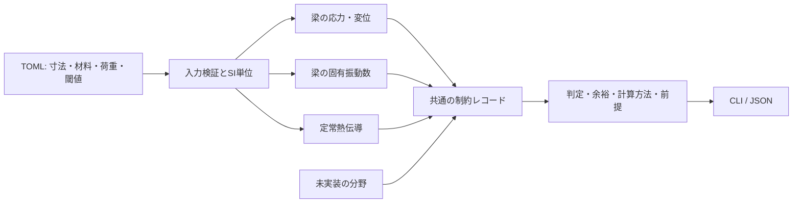

# 評価を統合する仕組み

## 初期の責務

- `case.py`: 入力の型・値・単位を確認する。SI単位をキー名に含め、未知のキーやスキーマ版を拒否する。単位変換UIは将来の別層。
- `models.py`: 物理量を返す。設計閾値やGUIを知らない。
- `evaluation.py`: 物理量を閾値と比べる。余裕は同じ単位で、上限制約なら「上限−値」、下限制約なら「値−下限」。異なる単位の余裕を足さない。
- `cli.py`: 入力を読み、結果を表示する。JSONに入力のスナップショットとモデル版を含める。

## 状態の意味

| 状態 | 意味 |
|---|---|
| `pass` | このモデル・条件・指標について制約を満たす |
| `fail` | 制約違反 |
| `not_evaluated` | モデル・データ・検証が未整備 |
| `not_applicable` | 対象外。将来使う場合には理由と適用条件が必要 |
| `error` | 有限の計算値を得られない等の計算エラー |

現時点で9分野は未評価。`overall_status` は、エラー→違反→未完了→合格の順で判定する。違反があっても他の未評価を結果から隠さない。`not_applicable` は型として予約しており、初版はどの分野も自動で対象外にしない。

## 共通入力と物理連成

初版は寸法を共有する並列評価。熱計算結果を弾性率や応力へ戻しておらず、熱構造連成ではない。動解析には先端力から推定した質量を勝手に入れない。

次段階で温度依存物性や熱膨張を扱う際は、データ依存と反復収束を明示する。FEM等の外部評価器は共通レコードに変換するアダプターで接続する。実行失敗・未収束を合格値に変換しない。

## 今後の拡張境界

- 複数案比較: まず同じ前提のケースを表で比較。未評価案を完全なパレート最適解と呼ばない。
- 製作・組立・保守: 閾値計算に加えて、幾何制約・離散判定・人の確認を結果として保存する。
- ソルバー連携: 形状ID・境界条件・メッシュ・単位・モデル版・実行ログの対応を保存する。
- 最適化: 目的関数と必須制約を分ける。微分できない判定やノイズのある評価に適した探索法を選ぶ。
- 試験照合: モデル実装の検証と、実機モデルの妥当性確認を分ける。ModalAnalysisとの接続はコード所在・I/O確認後に設計する。
