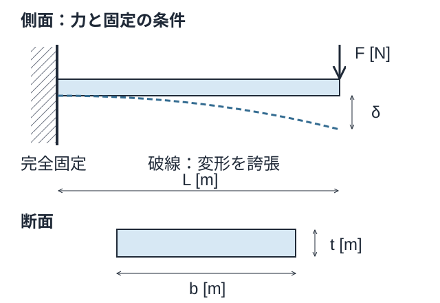
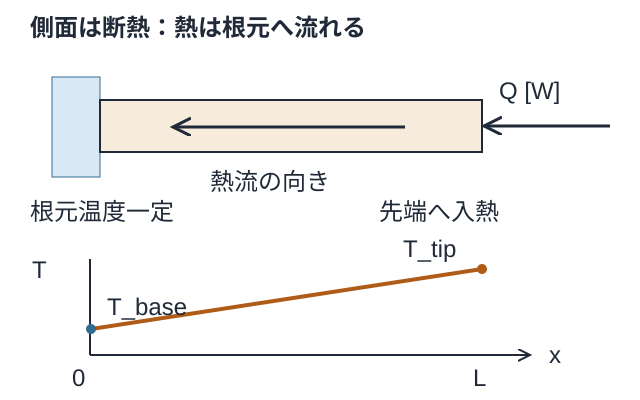
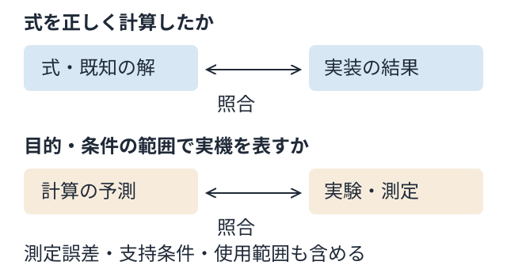
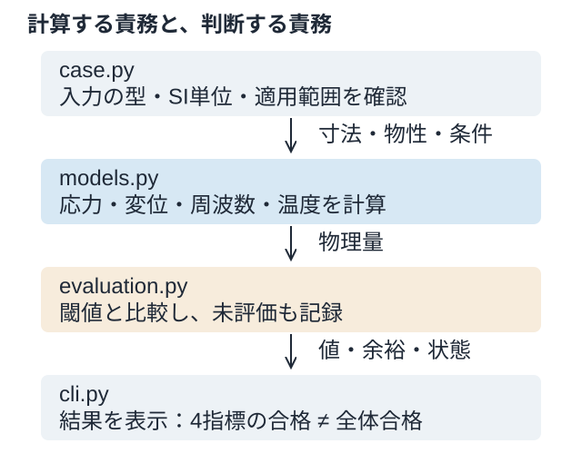

# 講義1：式から設計判断へ — 加熱される片持ち支持板

[一問一答と解説](#一問一答と解説)

対象は、応力・変位・振動・熱の基礎と、それらを統合するソフトウェアの最初のケース。**式の前提を説明し、計算を再現し、未評価も含めて判断できること**を目指す。

[ブラウザ版：寸法を変えて比較する](01-lecture.html) · [実習手順](01-heated-cantilever.md) · [参考文献](../references.md)

この資料はAI支援で作成した教育用資料。物性・閾値は仮定であり、実機試験による妥当性確認は未実施。個人の会話・解答・学習状況を含めず、第三者も同じ入力で再現できる構成にしている。図は本プロジェクトで作成した概念図で、転載図ではない。GitHubリポジトリは2026-09-08に公開。配布ライセンスは未設定で、別途決定する。

## この講義で確認する4条件

| 条件 | 示すもの | 対応する章 |
|---|---|---|
| C1 | 4指標の式・入力・単位・境界条件の説明 | 1〜3、確認Q1 |
| C2 | 数値一致と実機適用の違いの説明 | 4、確認Q2 |
| C3 | 3 mmと2 mmの比較の再現と解釈 | 5、確認Q3 |
| C4 | 評価器の追加場所と未評価管理の説明 | 6、確認Q4 |

倍率の予想はC1の一部。テスト成功、資料を読むこと、確認問題を開くことだけで、本人の学習完了にはしない。数式を参照しながら説明してよい。

## 1. まず「何を固定し、何を変えるか」を描く



### 力学の条件

- 長さ方向をxとし、左端x=0は完全固定。右端x=Lは自由端。
- 静解析では自由端に厚み方向の横荷重Fを加える。幅方向に曲げる場合は断面二次モーメントが変わる。
- 一様な長方形断面、均質な線形弾性材料、小変形のEuler–Bernoulli梁。せん断変形・回転慣性・自重・局所応力集中を含まない。
- 振動は同じ断面の梁単体の自由振動。付加質量・減衰・振動の強制応答・予荷重による剛性変化を含まない。

**静的な力F [N]と、振動する物体の質量m [kg]は別の入力。** 実物のおもりには静荷重と慣性の両方がある。現在のFを変更しても、振動計算に質量が追加されたことにはならない。

### 入力の単位

| 記号 | 意味 | SI単位 | 基準値 |
|---|---|---|---:|
| L, b, t | 長さ、幅、曲げ方向の厚み | m | 0.10、0.03、0.003 |
| E | ヤング率 | Pa = N/m² | 70×10⁹ |
| ρ | 密度 | kg/m³ | 2700 |
| F | 静的先端横荷重の大きさ | N | 1 |
| k | 熱伝導率 | W/(m·K) | 167 |
| Q | 単位時間当たりに供給する熱 | W = J/s | 1 |
| T_base | 根元の固定温度 | K | 298.15 |

3 mmは入力では0.003 m。70 GPaは70×10⁹ Pa。Qは「蓄えた熱量 [J]」でも「単位面積当たりの熱流束 [W/m²]」でもなく、熱の供給率 [W]。

## 2. 応力・たわみ・周波数の式をつなぐ

### 断面と曲げ剛性

```math
A=bt\quad[\mathrm{m^2}],\qquad
I=\int_A y^2\,dA=\frac{bt^3}{12}\quad[\mathrm{m^4}]
```

中立軸から遠い材料ほどIに大きく寄与する。曲げ剛性EIの単位はPa·m⁴ = N·m²。Iを面積Aと取り違えない。

### 公称曲げ応力

静的な釣り合いから、根元の曲げモーメントの大きさはFL。断面の最外縁は中立軸からt/2離れているため、最大の公称曲げ応力の大きさは次になる。

```math
\sigma_{max}=\frac{FL(t/2)}{I}
=\frac{6FL}{bt^2}\quad[\mathrm{Pa}]
```

これは引張・圧縮側の大きさを示す。締結穴やフィレットの局所ピーク、接触応力、疲労寿命をこの値だけで評価してはいけない。

### 先端たわみ

曲率と曲げモーメントを結ぶEI w″(x)=F(L−x)を、固定端の条件w(0)=0、w′(0)=0で積分すると、たわみの大きさは以下になる。

```math
w(x)=\frac{Fx^2(3L-x)}{6EI},\qquad
\delta=w(L)=\frac{FL^3}{3EI}
=\frac{4FL^3}{Ebt^3}\quad[\mathrm{m}]
```

応力を抑えられても、部品同士の隙間や位置精度の要求から、たわみの制約に違反する場合がある。応力とたわみは別の判定。

### 一次固有振動数

梁の分布した曲げ剛性と質量を用いる。固定端で変位・回転がゼロ、自由端で曲げモーメント・せん断力がゼロという自由振動の条件から、一次の定数1.875104…が得られる。

```math
f_1=\frac{1.875104^2}{2\pi L^2}
\sqrt{\frac{EI}{\rho A}}
\quad[\mathrm{Hz}]
```

EI/(ρA)の単位はm⁴/s²。その平方根をL²で割ると1/sとなる。固有振動数は「どこで共振しやすいか」の情報であり、応答振幅には加振と減衰等が必要。

### 寸法依存を整理する

他の条件を固定すると次になる。質量はm=ρAL。

| 指標 | 厚みtへの依存 | 幅bへの依存 |
|---|---|---|
| 質量 | t | b |
| 公称曲げ応力 | 1/t² | 1/b |
| 先端たわみ | 1/t³ | 1/b |
| 一次固有振動数 | t | 変わらない |
| 温度上昇（次章） | 1/t | 1/b |

厚みを増やすと曲げ剛性はt³、単位長さ当たりの質量はtに比例するので、周波数はtに比例。幅を増やすと剛性と質量が同じ倍率で増え、周波数式では相殺される。この結論は**今回の断面・曲げ方向・支持条件・付加質量なし**の範囲で使う。

## 3. 温度の式は「熱を逃がす道」の仮定で決まる



熱モデルでは、根元は理想的な恒温の熱浴に接続され、入れた熱を受け取る。先端からQを供給し、側面は断熱。定常・熱伝導率一定・一次元なので、Fourier則を積分できる。

```math
Q_x=-kA\frac{dT}{dx}=-Q,\qquad
T_{tip}-T_{base}=Q\frac{L}{kA}
```

ここでQ>0は供給量の大きさで、熱はxの負方向へ流れる。熱抵抗R_th=L/(kA)はK/W。Q [W]を掛けると温度差 [K]になる。

```math
T_{tip}=T_{base}+QR_{th}
```

板厚を2倍にすると半分になるのは**温度差ΔT**。絶対温度T_tipは半分にならない。温度差は1 K = 1 ℃の差だが、温度の値はKと℃で原点が違う。

根元の熱抵抗、側面の対流、放射、温度依存物性は未実装。すべての外面を断熱にしてQを入れ続ければ、このモデルのような定常的な排熱先はなくなる。温度を計算しただけでは熱応力の評価にもならない。熱膨張係数と変形拘束等を別途考える必要がある。

## 確認Q1：入力・単位・境界条件

1. 応力・たわみ・一次固有振動数・先端温度について、式の入力、出力単位、成立する境界条件を説明する。資料を参照してよい。
2. 先端に質量を持つセンサーを取り付けると、現在の振動式で何が不足するか。
3. 根元まで断熱に変え、Q>0の供給を続けると、現在の定常温度式を使えるか。エネルギーの行き先から説明する。

確認の観点：静荷重と質量、WとJ、温度と温度差を区別し、式が表す境界条件を示せること。

## 4. テストが通っても、実物を表せるとは限らない



**計算の検証（verification）**では、意図した式を正しく実装したかを見る。今回なら手計算、板厚による倍率、熱収支、入力単位の検査が証拠になる。

**実機に対する妥当性確認（validation）**では、目的・条件を定め、測定と計算を不確かさも含めて比べる。完全固定と仮定した根元が実際には柔らかい、センサー質量が無視できない、放熱面から空気へ熱が逃げるなどで、正しく計算した値と測定値は異なり得る。[NASAの検証解説](https://www.grc.nasa.gov/www/wind/valid/tutorial/verassess.html)・[妥当性確認の解説](https://www.grc.nasa.gov/www/wind/valid/tutorial/valassess.html)を、この教育モデルへ当てはめた整理。

測定側にも誤差がある。差を見つけてもすぐコードのバグと決めず、入力、境界条件、モデルの省略、測定の条件を調べる。計測値に合わせて支持剛性を調整しただけなら校正の証拠。別の条件でも予測を確かめることが必要。

### 確認Q2：数値一致と実機適用

テストがすべて通り、梁の式では約247 Hz、実物では約190 Hzだったとする。この2つの値だけでバグと断定できるか。調べる要因を2つ、追加の確認方法を1つ挙げる。190 Hzは確認問題用の架空値で、実測結果ではない。

## 5. 板厚3 mmと2 mmを実際に比べる

長さ・幅・材料・荷重・入熱・閾値を同じにして、厚みだけを変える。

```powershell
.\run.cmd cases\heated_cantilever.toml
.\run.cmd cases\heated_cantilever_2mm.toml
```

リポジトリ直下で実行する。2 mmケースの終了コード2は、予定した制約違反を返した結果。計算プログラムのクラッシュではない。

<!-- BEGIN GENERATED COMPARISON -->
| 指標 | 板厚3 mm | 板厚2 mm | 学習用制約 |
|---|---:|---:|---|
| 質量 | 24.30 g | 16.20 g | 上限未設定 |
| 公称曲げ応力 | 2.222 MPa（合格） | 5.000 MPa（合格） | 30 MPa以下 |
| 先端たわみ | 0.0705 mm（合格） | 0.2381 mm（違反） | 0.1 mm以下 |
| 一次固有振動数 | 246.76 Hz（合格） | 164.50 Hz（違反） | 200 Hz以上 |
| 先端温度 | 304.80 K（合格） | 308.13 K（合格） | 313.15 K以下 |
<!-- END GENERATED COMPARISON -->

この表は `scripts/build_lecture_data.py` が実際の評価器から生成する。丸める前のSI値で合否を判定している。閾値は学習用の設定で、規格値や認証済み材料の許容値ではない。

2 mmでは軽くなるが、たわみと固有振動数が違反する。応力だけを見れば採用してしまう可能性がある。3 mmでも9分野が未評価なので総合表示はINCOMPLETE。2 mmは違反があるためFAILで、未評価の9分野も残る。

**結果の余裕は単位を持つ。** 上限なら「上限−値」、下限なら「値−下限」。Pa、m、Hz、Kの余裕をそのまま足して一つの得点にしない。

### 確認Q3：再現と解釈

両ケースを実行し、次を報告する。

- 2 mmケースのたわみ・一次固有振動数と、それぞれの閾値。
- 採用を妨げる制約と、応力だけで判断した場合との差。
- 3 mmケースを「設計全体の合格」と呼べるか、その理由。

資料の数値の転記と、本人が実行して再現したことは別に確認する。ここまでができればC3の証拠になる。

## 6. 物理を計算する場所と、合否を決める場所



| ファイル | 責務 | 評価器を増やすとき |
|---|---|---|
| `src/mech_design/case.py` | 型、単位、値、モデルの適用範囲 | 新しい物性・荷重履歴等を明示的に追加 |
| `src/mech_design/models.py` | 物理量を計算 | 計算式・外部ソルバーの接続先。大きくなれば別モジュールへ |
| `src/mech_design/evaluation.py` | 閾値との比較、余裕、分野、未評価 | 計算値を共通レコードへ登録 |
| `src/mech_design/cli.py` | 結果を表示 | 計算式を埋め込まず、共通レコードを表示 |
| `tests/` | 数値と状態判定の検証 | 既知解・単位・失敗・未評価をテスト |

例えば疲労評価を加えるなら、材料の疲労データと荷重履歴を入力し、損傷等を計算する評価器を用意して、結果を判定へ接続する。必要データがないときにゼロ損傷を返すと、根拠のない合格になる。

初版の `evaluate()` は応力・たわみ・振動・熱を計算した後、登録がない分野へ `not_evaluated` を入れる。`overall_status()` はエラー、違反、未完了、合格の順に判定する。

| 状態 | 使い方 |
|---|---|
| `pass` | この指標・条件では制約を満たす |
| `fail` | 制約に違反する |
| `not_evaluated` | モデルやデータがなく、まだ評価していない |
| `not_applicable` | 理由付きで対象外と判断するための予約状態。初版は使わない |
| `error` | 計算値が非有限等の評価エラー |

ブラウザ版は、Pythonから生成した36通りの結果を切り替える。新たな物理計算や最適化を行わず、評価の意味を学ぶ比較画面。共通の寸法を共有しているが、温度を構造計算へ戻していないため熱構造連成ではない。

### 確認Q4：評価器の追加と未評価管理

疲労を評価したいがS-N曲線と荷重履歴がない場合、どの状態を返すべきか。追加が必要な入力、計算、判定のファイルを説明する。初期ケースの4指標が合格でも、総合合格にできない理由も説明する。

## 講義の確認方法

対話ではQ1から一問ずつ確認する。回答の正誤だけでなく、前提と理由を見る。本人による実行が必要なQ3は実行結果を確認する。公開用の教材には個人の回答を追記せず、必要な学習記録は個別に管理する。

## 出典と再現

- 梁の基礎と適用範囲：[MIT OCW Structural Mechanics](https://ocw.mit.edu/courses/16-20-structural-mechanics-fall-2002/pages/calendar/)、[梁のたわみ教材](https://ocw.mit.edu/courses/1-101-introduction-to-civil-and-environmental-engineering-design-i-fall-2006/resources/classex/)。本資料の導出と図は独自に構成。
- 梁の固有振動数：[FunctionBay RecurDynの片持ち梁解説・式(5.41)](https://help.functionbay.com/2026/RecurDynHelp/Analysis/Analysis_ch04_s05_03.html)。角振動数の解析式を参照し、本資料では f=ω/(2π) によりHzへ換算する。
- 熱伝導の学習入口：[MIT OCW Intermediate Heat and Mass Transfer](https://ocw.mit.edu/courses/2-51-intermediate-heat-and-mass-transfer-fall-2008/pages/readings/)。本ケースの式は定常1DのFourier則から導出。
- 数値モデルの検証・妥当性確認：上記NASAの2ページ。CFD向けの説明から考え方を参照し、梁ケースへ応用。
- 基準入力：`cases/heated_cantilever.toml`。比較入力：`cases/heated_cantilever_2mm.toml`。
- データ再生成：`.venv\Scripts\python.exe scripts\build_lecture_data.py`。整合確認は末尾に `--check`。

出典確認日：2026-09-07。更新時には出典リンク、学習用の仮定、図の表示、コードとの整合、ライセンス方針を再確認する。

<!-- BEGIN GENERATED QA -->
## 一問一答と解説

各問でいったん考え、解答例と解説を開いて確認する。対話で扱った論点を汎用の教材として再構成したもので、個人の回答・成績・実行記録ではない。解答例を読んだことと、自分で説明・実行できたことは別に確認する。


### L1-Q01

**問い：** 厚みtを2倍にすると、質量・曲げ応力・たわみ・一次固有振動数・温度上昇はどう変わるか。

<details>
<summary>解答例と解説</summary>

**解答例：** 順に2倍、1/4倍、1/8倍、2倍、1/2倍。

**解説：** 長さ・幅・材料・先端力・入熱を固定する。I=bt³/12より応力はt⁻²、たわみはt⁻³、付加質量なしの一様梁の周波数はtに比例する。温度上昇は根元温度固定・側面断熱の1D伝導モデルでの倍率で、放射冷却にはそのまま使えない。

</details>

### L1-Q02

**問い：** 幅bを2倍にすると、同じ5指標はどう変わるか。

<details>
<summary>解答例と解説</summary>

**解答例：** 順に2倍、1/2倍、1/2倍、1倍、1/2倍。

**解説：** 厚みなどを固定する。周波数の式では曲げ剛性EIと単位長さ質量ρAがともに2倍になり、比が変わらない。先端付加質量があるモデルでは、この相殺を無条件に使えない。

</details>

### L1-Q03

**問い：** 幅と厚みのどちらを増すと、現在のモデルで周波数を上げられるか。

<details>
<summary>解答例と解説</summary>

**解答例：** 厚みを増す。

**解説：** ただし周波数だけで決めない。重量、寸法、熱の処理、製作や組立などの制約と同時に評価する。現在の計算で未評価の分野は、合格したものとして扱わない。

</details>

### L1-Q04

**問い：** 曲げ応力σ=6FL/(bt²)の単位は何か。

<details>
<summary>解答例と解説</summary>

**解答例：** Pa。

**解説：** 分子は力×長さ、分母は長さの3乗なので、N·m/m³=N/m²=Paとなる。Nとkg、mmとmを入力で混在させない。

> [σ] = [N·m]/[m³] = [N/m²] = [Pa]

</details>

### L1-Q05

**問い：** 熱抵抗L/(kA)と、温度上昇QL/(kA)の単位は何か。

<details>
<summary>解答例と解説</summary>

**解答例：** 熱抵抗はK/W、温度上昇はK。

**解説：** kの単位はW/(m·K)、Aはm²。ここでQは熱量[J]ではなく熱流率・発熱電力[W]を表す。温度差はKと℃で同じ数値だが、放射式の温度には絶対温度を使う。

> [L/(kA)] = m / ((W/(m·K))·m²) = K/W； [Q·L/(kA)] = K

</details>

### L1-Q06

**問い：** たわみFL³/(3EI)の単位は何か。

<details>
<summary>解答例と解説</summary>

**解答例：** m。

**解説：** EはPa=N/m²、断面二次モーメントIはm⁴なのでEIはN·m²。したがってN·m³/(N·m²)=m。係数3は無次元。

> [EI] = kg·m³/s²； [FL³/(EI)] = m

</details>

### L1-Q07

**問い：** f₁=β₁²√(EI/(ρA))/(2πL²)の単位は何か。

<details>
<summary>解答例と解説</summary>

**解答例：** s⁻¹、すなわちHz。

**解説：** ρAはkg/m、EI/(ρA)はm⁴/s²。平方根を取るとm²/sで、L²で割ると1/sになる。β₁と2πは無次元で、角振動数ωと周波数fを区別する。

> [EI/(ρA)] = m⁴/s²； [f₁] = (1/m²)·(m²/s) = Hz

</details>

### L1-Q08

**問い：** 先端にセンサ質量を取り付けたとき、現在の固有振動数式をそのまま使えるか。

<details>
<summary>解答例と解説</summary>

**解答例：** 付加質量の影響を評価するには、そのままでは不足する。

**解説：** 現在の解析式とM2aの梁FEMは梁自身の分布質量を扱い、先端質量は含まない。静的先端力Fを入力したことは、動的質量を追加したことにはならない。拡張では先端変位自由度の質量などを加え、取り付け剛性やセンサの回転慣性が必要かも検討する。

</details>

### L1-Q09

**問い：** 根元への伝導を断ち、真空中で低温の周囲へ熱を逃がす場合、必要な式は何か。

<details>
<summary>解答例と解説</summary>

**解答例：** 熱放射による正味の熱移動を熱収支に加える。

**解説：** 一様温度の灰色面が大きな等温黒体囲いを見ている近似では、下式を使える。εは放射率、σ_SBはStefan–Boltzmann定数、A_radは放射面積。伝導断熱だけで放射が支配的とは断定できず、空気があれば対流も調べる。周囲との形態係数や相互反射が効く場合は拡張が必要。現行CLIには未実装。

> Q_rad = εσ_SB A_rad(T⁴ − T_sur⁴)； T、T_surはK

[出典・照合先](https://www.nasa.gov/smallsat-institute/sst-soa/thermal-control/)

</details>

### L1-Q10

**問い：** 温度が上がる速さを考えるには、定常熱抵抗に加えて何が必要か。

<details>
<summary>解答例と解説</summary>

**解答例：** 熱容量C。

**解説：** 温度を一様とみなす集中定数モデルではC=mc_p [J/K]を使う。Cが大きいほど、同じ正味入熱に対する温度変化は遅い。内部温度差が大きい場合は、分布した熱伝導の過渡解析が必要。現行CLIの定常式は時間変化を計算しない。

> C dT/dt = Q_in − Q_cond − Q_conv − Q_rad

</details>

### L1-Q11

**問い：** 伝導・対流・正味放射のすべてで外へ熱が逃げず、正の発熱が続く場合、定常温度はあるか。

<details>
<summary>解答例と解説</summary>

**解答例：** このモデルでは有限の定常温度はなく、温度が上がり続ける。

**解説：** 定常に必要な入熱と放熱の釣合いを満たせない。CとQ_inが一定ならT=T₀+(Q_in/C)t。実物では物性変化や相変化などで単純モデルの適用限界に達する。部品と囲いの間の放射は、完全断熱な系全体からの放熱とは別である。

</details>

### L1-Q12

**問い：** 計算約247 Hz、実測約190 Hzだったとする。バグ以外に何を調べるか。

<details>
<summary>解答例と解説</summary>

**解答例：** センサ取り付けによる質量負荷と、実物の固定条件の違いなど。

**解説：** この実測値は説明用の仮想値。センサの影響には既知の追加質量を変える比較、固定条件には締結数・締付けや接合部の変更が考えられる。変更が質量と剛性の両方に影響する点を記録し、可能なら非接触測定などで切り分ける。測定誤差と測定対象そのものの変化を区別する。

</details>

### L1-Q13

**問い：** たわみ0.000238095 m≤0.0001 m、周波数164.504 Hz≥200 Hzという条件は合格か。

<details>
<summary>解答例と解説</summary>

**解答例：** どちらも不合格。

**解説：** たわみは上限を超え、周波数は下限に届かない。表示丸め前の余裕は約−0.000138095 mと−35.4956 Hz。単位の異なる余裕をそのまま足さず、各制約を判定する。

</details>

### L1-Q14

**問い：** 板厚3 mmで評価済みの4指標が合格なら、設計全体を合格としてよいか。

<details>
<summary>解答例と解説</summary>

**解答例：** よくない。疲労など9分野が未評価なので、総合はincomplete。

**解説：** passはその指標と条件に限る。未評価を含む通常CLIの終了コード0も、製品承認や全12分野の妥当性確認を意味しない。

</details>

### L1-Q15

**問い：** 疲労データや荷重履歴が不足している場合、損傷ゼロを返してよいか。

<details>
<summary>解答例と解説</summary>

**解答例：** よくない。not_evaluatedと、欠けている情報を返す。

**解説：** 未評価を無損傷と扱うと、繰り返し荷重による疲労破壊を見落とす。評価した結果のfail、データ不足のnot_evaluated、計算異常のerrorを分ける。

</details>

### L1-Q16

**問い：** 疲労評価を追加する場合、入力・計算・判定には何が必要か。

<details>
<summary>解答例と解説</summary>

**解答例：** 形状・物性・荷重履歴を入力し、応力／ひずみと寿命・損傷を計算して、位置ごとに判定する。

**解説：** 入力には繰り返し回数、平均応力、環境条件、モデルに対応する材料試験データも必要。S-N/Basquin、ε-N/Coffin–Manson、累積損傷やエネルギー法は適用範囲の異なる選択肢で、必ず全部を重ねるものではない。NG箇所の表示には位置IDと局所結果を保持する。必要情報がない位置は未評価として残す。

</details>
<!-- END GENERATED QA -->
