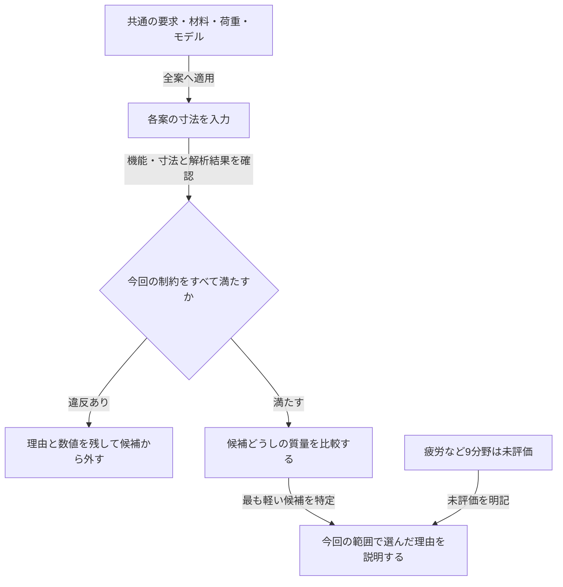

# 講義2：制約を満たす設計案を比較する

M1では、複数の設計案を同じ条件で計算し、選んだ理由を説明する。最初の題材は、加熱される片持ち支持板の軽量化。個別技術として寸法依存・感度・支配制約を、統合技術として比較条件・評価結果・計算の来歴を学ぶ。

[講義1](01-lecture.md) · [ロードマップ](../roadmap.md) · [統合の構造](../architecture.md)

AI支援で作成した学習用資料。物性・要求は架空の教材条件であり、実機の安全性を保証しない。学習者個人の解答・会話履歴は含めない。

## 1. 目的・制約・設計変数を分ける


| 分類 | 今回の設定 | 判断での役割 |
|---|---|---|
| 目的 | 質量を小さくする | 制約を満たす候補どうしを比較する |
| 機能上の制約 | 根元から100 mmの位置で先端の荷重を支持する。この直線梁ではL = 100 mm | 軽くても所定の位置に届かなければ候補に残せない |
| 寸法の制約 | 幅b ≤ 45 mm、厚みt ≤ 4 mm | 設置空間に収める |
| 性能の制約 | 応力 ≤ 30 MPa、たわみ ≤ 0.100 mm、一次固有振動数 ≥ 200 Hz、先端温度 ≤ 313.15 K | それぞれ独立に合否を判定する |
| 設計変数 | 幅b、厚みt | 今回変更してよい寸法。長さ変更案も比較表に載せ、機能制約で判定する |
| 固定する条件 | 材料、静的先端力1 N、発熱量率1 W、根元温度298.15 K、モデルの境界条件と判定閾値 | 寸法を変えた効果を比較できるようにする |

長さ・幅・厚みの要求はこの講義で追加した学習用条件。現在の単一ケースCLIはこれらの機能・設置制約を判定しないため、以下では表で別途確認する。製造公差はまだ扱わない。

質量には今回は上限を設けず、最小化する目的として使う。「質量30 g以下」という予算を追加する場合は、質量を制約としても判定する。目的と制約に同じ物理量を使ってよい。



制約を先に確認することで、例えば「たわみ違反を軽さで埋め合わせる」という判定を防げる。異なる単位のmarginをそのまま足して総合点にしてはいけない。

## 2. 同じモデルで4案を計算する

基準は `cases/heated_cantilever.toml`。各案は寸法だけを変更する。計算モデルは `analytical_baseline_v1`、先端質量なし・小変形の一様梁、根元温度固定・側面断熱の定常熱伝導である。

| 案 | 変更 | L [mm] | b [mm] | t [mm] | 質量 [g] |
|---|---|---:|---:|---:|---:|
| A | 基準 | 100 | 30 | 3 | 24.30 |
| B | 薄くする | 100 | 30 | 2 | 16.20 |
| C | 幅を広げる | 100 | 45 | 3 | 36.45 |
| D | 短く薄くする | 70 | 30 | 2 | 11.34 |

| 案 | 応力 [MPa] | たわみ [mm] | 一次固有振動数 [Hz] | 先端温度 [K] |
|---|---:|---:|---:|---:|
| A | 2.222 | 0.07055 | 246.757 | 304.803 |
| B | 5.000 | 0.23810 | 164.504 | 308.130 |
| C | 1.481 | 0.04703 | 246.757 | 302.586 |
| D | 3.500 | 0.08167 | 335.723 | 305.136 |

表示値は丸めている。合否判定には丸める前の値を使う。これらの値は既存のPythonモデルで再計算した。Dでは荷重・加熱の作用位置も先端とともに70 mmへ移るため、100 mm位置での支持・加熱の計算結果とは見なせない。

### 最初の確認

1. 今回の制約をすべて満たす候補はどれか。外す案には理由を付ける。
2. 残った候補のうち、軽量化を目的としてどれを選ぶか。
3. 選んだ案を「全分野で合格」「連続的な寸法範囲で最適」と呼べるか。

まず自分で判断し、物理モデルの合否と機能・寸法の合否を分けて説明する。

## 3. 寸法依存から支配制約を考える

材料・荷重・熱入力を一定とした、現在のモデルの比例関係は次のとおり。

| 指標 | 長さLへの依存 | 幅bへの依存 | 厚みtへの依存 |
|---|---|---|---|
| 質量 | L | b | t |
| 曲げ応力 | L | 1/b | 1/t² |
| たわみ | L³ | 1/b | 1/t³ |
| 一次固有振動数 | 1/L² | 依存なし | t |
| 温度上昇 | L | 1/b | 1/t |

例えば幅を広げると、たわみは減るが、この梁モデルの固有振動数は変わらない。長さを短くすれば多くの数値が改善するが、機能を満たす寸法かどうかは別に確認する。

「支配制約」は、ある設計変更を進めたときに、その変更を制限する条件として考える。異なる単位のmarginの数値の小ささだけでは決められない。

次の演習ではL = 100 mm、b = 30 mmを固定し、tを連続的に小さくする。各制約から厚みの下限を求め、最初に境界へ達する制約を説明する。ここでは実際に選べる板厚・公差・疲労などは未評価である。

## 4. 比較機能に保存する情報

| 情報 | 必要な理由 |
|---|---|
| 共通の要求とその版 | 案ごとに合格基準を緩めた結果を混ぜないため |
| 案の識別子・寸法・材料・荷重・熱条件 | 何を変え、何を固定したか確認するため |
| モデル版・境界条件・入力スナップショット | 同じ数値を再現し、適用範囲を判断するため |
| 指標値・単位・閾値・margin・状態・理由 | 合否と未評価を追跡するため |
| 今回の制約を満たす候補か、製品全体の評価状態 | 限定した比較ができることと、製品全体の評価完了を区別するため |

単一ケースの評価器を繰り返し呼び、結果を共通の要求と照合する比較層を設計する。材料や荷重も変える試験を行うなら、その差を明示し、寸法だけの効果とは解釈しない。入力不備・計算エラー・未評価は値0や合格へ変換しない。

## 5. 表を再現する

セットアップ済みのリポジトリ直下で、以下をPythonとして実行する。A〜Dの入力は基準ケースから生成し、比較表の物理量を表示する。機能・寸法制約の自動判定や案の自動選択はこの例には含めていない。

```python
from dataclasses import replace
from pathlib import Path

from mech_design.case import load_case
from mech_design.evaluation import evaluate

base = load_case(Path("cases/heated_cantilever.toml"))
designs = [
    ("A", 0.100, 0.030, 0.003),
    ("B", 0.100, 0.030, 0.002),
    ("C", 0.100, 0.045, 0.003),
    ("D", 0.070, 0.030, 0.002),
]
print("id,mass_g,stress_MPa,deflection_mm,frequency_Hz,temperature_K,overall")
for name, length, width, thickness in designs:
    beam = replace(
        base.beam, length_m=length, width_m=width, thickness_m=thickness
    )
    result = evaluate(replace(base, name=name, beam=beam))
    values = {item["metric"]: item["value"] for item in result["evaluations"]}
    print(
        f"{name},{result['mass_kg'] * 1000:.2f},"
        f"{values['root_stress'] / 1e6:.3f},"
        f"{values['tip_deflection'] * 1000:.5f},"
        f"{values['first_frequency']:.3f},"
        f"{values['tip_temperature']:.3f},{result['overall_status']}"
    )
```

基準ケース・式・出力構造を変更した場合はこの例を再実行し、表と前提を更新する。元の力学・熱の式と出典は[講義1](01-lecture.md)に記載している。

## M1の完了条件

- 目的、制約、設計変数、固定条件を区別して比較案を説明できる。
- 長さ・幅・厚みを変えた比較を再現し、機能制約も含めて選択理由を示せる。
- 厚みを下げるときの支配制約を、式と計算で説明できる。
- 比較機能で条件の差・結果の来歴・未評価を保持し、その動作を確認できる。

この資料を作成したことや4案を計算したことだけで、M1全体の学習・実装完了とはしない。
