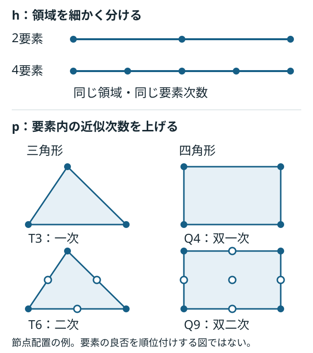

# 講義3：メッシュ・要素形状・次数を選び、収束を確かめる

[ブラウザ版](03-fem.html) · [講義2](02-design-comparison.md) · [ロードマップ](../roadmap.md)

M2は有限要素法の数値モデルと、その評価結果を統合する仕組みを学ぶ。まず梁要素で行列の組み立て・拘束・振動を確認し、次に2次元連続体要素でメッシュ配置、要素形状、近似次数を比較する。本資料はAI支援で作成した計画と講義であり、M2のソルバー実装・実測結果はまだない。図は本プロジェクトの概念図で、転載図ではない。

## 1. FEMで選ぶものを分ける



| 選択 | 何を変えるか | 比較するときの注意 |
|---|---|---|
| 物理モデル | 梁、シェル、平面応力、3次元ソリッドなど | 省略する変形・拘束が違う。メッシュ細分化だけでは梁理論の仮定は変わらない |
| 要素形状 | 線、三角形、四角形、四面体、六面体など | 形状だけで優劣を決めず、次数・積分法・品質・問題をそろえる |
| メッシュ配置と寸法h | 要素数、一様／局所細分化、勾配方向の分割 | 部品自体の寸法や荷重位置は変えない |
| 近似次数p | 要素内で変位などを表す関数の次数 | 節点数と次数を同一視しない。物理場と幾何形状の近似も区別する |
| 要素品質 | ゆがみ、アスペクト比、ヤコビアンなど | ゆがみへの感度は要素による。逆転・退化した要素を許容しない |
| 定式化と積分 | 完全／低減積分、せん断の扱いなど | ロッキングや不要なゼロエネルギーモードの可能性も確認する |

hを小さくする方法とpを上げる方法は別の細分化戦略。収束を見る指標を先に決める。[COMSOLのメッシュ収束解説](https://www.comsol.com/support/knowledgebase/1261)

曲げ問題での精度は、要素の次数だけでなく積分法やゆがみにも依存する。特定の要素が良好だったベンチマーク結果を、すべての形状・材料へ一般化しない。[Abaqusの曲げベンチマーク](https://docs.software.vt.edu/abaqusv2025/English/SIMACAEBMKRefMap/simabmk-c-linbending.htm)

## 2. 最初は2節点の梁要素

一定のEIを持つEuler–Bernoulli梁を、長さ方向へ1、2、4、8、16要素に分割する。各節点の未知量は、横変位wと回転θの2つ。

```math
\mathbf{q}_e=[w_1,\theta_1,w_2,\theta_2]^T,
\qquad w^h(x)=\mathbf{N}(x)\mathbf{q}_e
```

標準的な適合Hermite梁要素では、変位と傾きの接続条件を満たす三次補間を使う。したがって、**2節点だから一次要素、とは言えない**。静的な曲げ剛性行列を要素ごとに作り、共有節点の自由度へ足し合わせる。[TU Delftの梁要素講義](https://interactivetextbooks.citg.tudelft.nl/computational-modelling/structural_linear/euler_bernouilli.html)

```math
\mathbf{K}\mathbf{q}=\mathbf{F},
\qquad
\mathbf{K}\boldsymbol{\phi}=\omega^2\mathbf{M}\boldsymbol{\phi},
\qquad f=\frac{\omega}{2\pi}
```

静解析では節点変位・回転、自由振動解析では固有値・モードを求める。根元のwとθを0に拘束し、自由な自由度で方程式を解く。質量行列は変位の補間と密度から作る整合質量行列を最初の基準にする。[TU Delftの梁動解析演習](https://interactivetextbooks.citg.tudelft.nl/computational-modelling/dynamics/Exercises/str_elem_dyn_workshops/Workshop_FEM_dyn_beam.html)

## 3. 収束試験の題材にも向き不向きがある

現在の一様梁・先端力F・完全固定という条件では、静的なたわみの解析解は次になる。

```math
w(x)=\frac{F x^2(3L-x)}{6EI}
```

これはxの三次式。三次Hermite要素の近似空間で表せるため、正しい組み立て・境界条件・積分なら、1要素でもこの静的解を丸め誤差の範囲で再現できる。これは式と近似空間から導ける本ケース固有の性質で、M2の実測結果ではない。

**したがって、先端たわみの一致だけでメッシュ収束を実証したことにはしない。** 静解析は実装・反力の検証に使い、三次多項式で厳密には表せない自由振動モードの固有振動数でh収束を調べる。後続の2次元ケースでは、曲げの変位場や応力場も比較対象にする。

## 4. M2を二段階で進める

| 段階 | 比較するもの | 主な確認 |
|---|---|---|
| M2a：1次元梁 | Hermite梁、整合質量、1→2→4→8→16要素 | 静的解・反力、一次固有振動数、拘束とモード、h収束 |
| M2b：2次元連続体 | 平面応力のT3/T6、Q4/Q9を候補に選定 | 要素形状・次数・ゆがみ、厚み方向の分割、応力評価位置 |

M2bの比較は、まず同じ形状・荷重・拘束の中で要素とメッシュを変える。同じ要素数でも未知数の数は違うので、自由度数・誤差・実行時間を併記する。時間は実装やソルバーにも依存するため、要素の性質だけとは解釈しない。

平面応力の連続体とEuler–Bernoulli梁では、せん断変形や固定端近傍の応力状態の扱いが違う。梁解との差がすべてメッシュ誤差とは限らない。長さ対厚みの比や評価位置を明示し、同じ連続体モデル内のメッシュ収束と分けて評価する。最初から四面体・六面体まで同時実装する計画ではない。

## 5. 何をもって収束とするか

```math
e_n=\frac{|f_n-f_{\mathrm{ref}}|}{|f_{\mathrm{ref}}|},
\qquad
d_n=\frac{|f_{2n}-f_n|}{|f_{2n}|}
```

eは解析解に対する誤差、dは分割を倍にしたときの変化。dが小さいだけでは、正しいモデルを解いている保証にならない。線形方程式・固有値問題の残差と、メッシュを変えたときの変化も別に記録する。

M2aの初期実装に向け、次の教育用検証基準を置く。実機の許容差ではない。

- 静解析：先端変位・根元反力と反力モーメントを解析値と照合。非ゼロの基準量に対する相対誤差1e-8以下を初期目標とする。
- 振動：基準ケースの一次固有振動数を既存解析解と比較。16要素時の相対誤差0.1%以下、8→16要素時の変化0.1%以下を初期目標とする。全分割の値を保存する。
- 線形代数：縮約した剛性・質量行列の対称性、拘束後の正の固有値、規格化した残差を確認する。残差の規格化は変位と回転の単位差を考慮して実装時に定義する。
- 異常系：無効な要素数、未対応要素、拘束不足、退化要素、計算失敗を合格へ変換しない。

2次元モデルの鋭い角や点荷重位置では応力特異点が生じることがある。最大応力が細分化とともに増え続ける場合は、最大値だけを収束指標にせず、荷重分布・形状・評価位置を見直す。比較点は固定した物理座標で定義する。[COMSOLの特異点解説](https://www.comsol.com/blogs/how-identify-resolve-singularities-model-meshing/)

## 6. 統合ツールへ追加する記録

M1の寸法・材料・境界条件・モデル版に、節点座標・要素接続・要素種類・補間次数・積分法・質量行列方式・拘束自由度・自由度数・ソルバー設定を加える。参照解の版、誤差、残差、反力、メッシュ品質、失敗理由も結果へ対応付ける。

解析の入力が同じでも、メッシュやソルバー設定が違えば別の数値実験として保存する。ソルバーが正常終了したこと、メッシュ収束したこと、設計制約を満たしたこと、実機で妥当なことを区別する。

## 最初の確認

Euler–Bernoulli梁の曲げでは、曲率が変位の二階微分に対応する。

```math
\kappa\approx\frac{d^2w}{dx^2},\qquad M=EI\kappa
```

**各要素内の変位を単純な直線w(x)=a+bxだけで表すと、要素内部の曲率はどうなるか。曲げを表すうえで何が不足するか。** ここでは変位wだけを未知場とする標準的な梁の定式化を考える。

## M2の完了条件

- メッシュ寸法h、要素形状、次数p、物理モデル、積分法の違いを説明できる。
- M2aの静的解・反力・固有振動数を再現し、1要素で静的解が一致する理由と振動の収束結果を説明できる。
- M2bで形状・次数・品質を変え、自由度数と誤差を使って選択理由を示せる。
- 設定・メッシュ・結果の来歴を保存し、異常系が合格にならないことを確認できる。

M2aの成功だけで、M2bや実機の妥当性確認まで完了とはしない。
