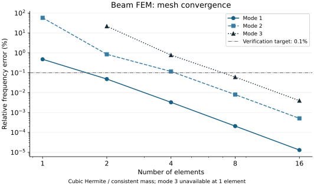
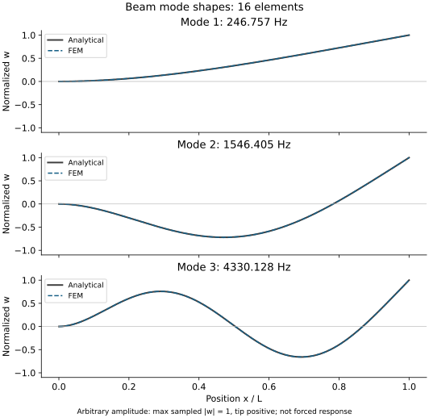

# 講義3：メッシュ・要素形状・次数を選び、収束を確かめる

[一問一答と解説](#一問一答と解説)

[ブラウザ版](03-fem.html) · [講義2](02-design-comparison.md) · [ロードマップ](../roadmap.md)

次の講義：[講義4：FEMの比較実験を設計する](04-fem-benchmark.md)。純曲げの参照解を使い、M2bの比較条件を具体化する。

M2は有限要素法の数値モデルと、その評価結果を統合する仕組みを学ぶ。まず梁要素で行列の組み立て・拘束・振動を確認し、次に2次元連続体要素でメッシュ配置、要素形状、近似次数を比較する。M2aの梁FEMをAI支援で実装し、数値結果を以下に掲載した。M2bは計画段階。図は本プロジェクトの概念図と計算結果で、転載図ではない。

## 1. FEMで選ぶものを分ける


| 選択 | 何を変えるか | 比較するときの注意 |
|---|---|---|
| 物理モデル | 梁、シェル、平面応力、3次元ソリッドなど | 省略する変形・拘束が違う。メッシュ細分化だけでは梁理論の仮定は変わらない |
| 要素形状 | 線、三角形、四角形、四面体、六面体など | 形状だけで優劣を決めず、次数・積分法・品質・問題をそろえる |
| メッシュ配置と寸法h | 要素数、一様／局所細分化、勾配方向の分割 | 部品自体の寸法や荷重位置は変えない |
| 近似次数p | 要素内で変位などを表す関数の次数 | 節点数と次数を同一視しない。物理場と幾何形状の近似も区別する |
| 要素品質 | ゆがみ、アスペクト比、ヤコビアンなど | ゆがみへの感度は要素による。逆転・退化した要素を許容しない |
| 定式化と積分 | 完全／低減積分、せん断の扱いなど | ロッキングや不要なゼロエネルギーモードの可能性も確認する |

hを小さくする方法とpを上げる方法は別の細分化戦略。収束を見る指標を先に決める。[COMSOLのメッシュ収束解説](https://www.comsol.com/support/knowledgebase/1261)

曲げ問題での精度は、要素の次数だけでなく積分法やゆがみにも依存する。特定の要素が良好だったベンチマーク結果を、すべての形状・材料へ一般化しない。[Abaqusの曲げベンチマーク](https://docs.software.vt.edu/abaqusv2025/English/SIMACAEBMKRefMap/simabmk-c-linbending.htm)

## 2. 最初は2節点の梁要素

一定のEIを持つEuler–Bernoulli梁を、長さ方向へ1、2、4、8、16要素に分割する。各節点の未知量は、横変位wと回転θの2つ。

```math
\mathbf{q}_e=[w_1,\theta_1,w_2,\theta_2]^T,
\qquad w^h(x)=\mathbf{N}(x)\mathbf{q}_e
```

標準的な適合Hermite梁要素では、変位と傾きの接続条件を満たす三次補間を使う。したがって、**2節点だから一次要素、とは言えない**。静的な曲げ剛性行列を要素ごとに作り、共有節点の自由度へ足し合わせる。[TU Delftの梁要素講義](https://interactivetextbooks.citg.tudelft.nl/computational-modelling/structural_linear/euler_bernouilli.html)

```math
\mathbf{K}\mathbf{q}=\mathbf{F},
\qquad
\mathbf{K}\boldsymbol{\phi}=\omega^2\mathbf{M}\boldsymbol{\phi},
\qquad f=\frac{\omega}{2\pi}
```

静解析では節点変位・回転、自由振動解析では固有値・モードを求める。根元のwとθを0に拘束し、自由な自由度で方程式を解く。質量行列は変位の補間と密度から作る整合質量行列を最初の基準にする。[TU Delftの梁動解析演習](https://interactivetextbooks.citg.tudelft.nl/computational-modelling/dynamics/Exercises/str_elem_dyn_workshops/Workshop_FEM_dyn_beam.html)

## 3. 収束試験の題材にも向き不向きがある

現在の一様梁・先端力F・完全固定という条件では、静的なたわみの解析解は次になる。

```math
w(x)=\frac{F x^2(3L-x)}{6EI}
```

これはxの三次式。三次Hermite要素の近似空間で表せるため、正しい組み立て・境界条件・積分なら、1要素でもこの静的解を丸め誤差の範囲で再現できる。これは式と近似空間から導ける本ケース固有の性質で、M2の実測結果ではない。

**したがって、先端たわみの一致だけでメッシュ収束を実証したことにはしない。** 静解析は実装・反力の検証に使い、三次多項式で厳密には表せない自由振動モードの固有振動数でh収束を調べる。後続の2次元ケースでは、曲げの変位場や応力場も比較対象にする。

## 4. M2を二段階で進める

| 段階 | 比較するもの | 主な確認 |
|---|---|---|
| M2a：1次元梁 | Hermite梁、整合質量、1→2→4→8→16要素 | 静的解・反力、一次固有振動数、拘束とモード、h収束 |
| M2b：2次元連続体 | 平面応力のT3/T6、Q4/Q9を候補に選定 | 要素形状・次数・ゆがみ、厚み方向の分割、応力評価位置 |

M2bの比較は、まず同じ形状・荷重・拘束の中で要素とメッシュを変える。同じ要素数でも未知数の数は違うので、自由度数・誤差・実行時間を併記する。時間は実装やソルバーにも依存するため、要素の性質だけとは解釈しない。

平面応力の連続体とEuler–Bernoulli梁では、せん断変形や固定端近傍の応力状態の扱いが違う。梁解との差がすべてメッシュ誤差とは限らない。長さ対厚みの比や評価位置を明示し、同じ連続体モデル内のメッシュ収束と分けて評価する。最初から四面体・六面体まで同時実装する計画ではない。

## 5. 何をもって収束とするか

```math
e_n=\frac{|f_n-f_{\mathrm{ref}}|}{|f_{\mathrm{ref}}|},
\qquad
d_n=\frac{|f_{2n}-f_n|}{|f_{2n}|}
```

eは解析解に対する誤差、dは分割を倍にしたときの変化。dが小さいだけでは、正しいモデルを解いている保証にならない。線形方程式・固有値問題の残差と、メッシュを変えたときの変化も別に記録する。

M2aの初期実装に向け、次の教育用検証基準を置く。実機の許容差ではない。

- 静解析：先端変位・根元反力と反力モーメントを解析値と照合。非ゼロの基準量に対する相対誤差1e-8以下を初期目標とする。
- 振動：基準ケースの一次固有振動数を既存解析解と比較。16要素時の相対誤差0.1%以下、8→16要素時の変化0.1%以下を初期目標とする。全分割の値を保存する。
- 線形代数：縮約した剛性・質量行列の対称性、拘束後の正の固有値、規格化した残差を確認する。残差の規格化は変位と回転の単位差を考慮して実装時に定義する。
- 異常系：無効な要素数、未対応要素、拘束不足、退化要素、計算失敗を合格へ変換しない。

2次元モデルの鋭い角や点荷重位置では応力特異点が生じることがある。最大応力が細分化とともに増え続ける場合は、最大値だけを収束指標にせず、荷重分布・形状・評価位置を見直す。比較点は固定した物理座標で定義する。[COMSOLの特異点解説](https://www.comsol.com/blogs/how-identify-resolve-singularities-model-meshing/)

## 6. 統合ツールへ追加する記録

M1の寸法・材料・境界条件・モデル版に、節点座標・要素接続・要素種類・補間次数・積分法・質量行列方式・拘束自由度・自由度数・ソルバー設定を加える。参照解の版、誤差、残差、反力、メッシュ品質、失敗理由も結果へ対応付ける。

解析の入力が同じでも、メッシュやソルバー設定が違えば別の数値実験として保存する。ソルバーが正常終了したこと、メッシュ収束したこと、設計制約を満たしたこと、実機で妥当なことを区別する。

## 最初の確認

Euler–Bernoulli梁の曲げでは、曲率が変位の二階微分に対応する。

```math
\kappa\approx\frac{d^2w}{dx^2},\qquad M=EI\kappa
```

**各要素内の変位を単純な直線w(x)=a+bxだけで表すと、要素内部の曲率はどうなるか。曲げを表すうえで何が不足するか。** ここでは変位wだけを未知場とする標準的な梁の定式化を考える。

## M2aの実行と結果

```powershell
.\run.cmd fem cases\cantilever_fem.toml
.\run.cmd fem cases\cantilever_fem.toml --output outputs\my-fem.json
.\run.cmd fem --replay outputs\my-fem.json
```

既存環境はREADMEの依存更新手順でNumPy/SciPyを追加する。保存先が存在する場合は別名を指定する。設定は要素数の倍増列（1〜64の整数）、第1〜3モード、三次Hermite・整合質量・根元完全固定に限定する。任意メッシュ・ヒンジ・自由支持への切替は未実装で、指定すると入力で拒否する。

基準ケースの解析値は一次固有振動数246.7565296 Hz。各分割で先端たわみ0.070546737 mm、反力−1 N、反力モーメント−0.1 N·mを再現した。

| 要素数 | 一次固有振動数 [Hz] | 解析解に対する相対誤差 [%] |
|---:|---:|---:|
| 1 | 247.929690 | 0.475432 |
| 2 | 246.875821 | 0.0483437 |
| 4 | 246.764601 | 0.00327081 |
| 8 | 246.757044 | 0.000208302 |
| 16 | 246.756562 | 0.0000130750 |



図の横軸は要素数、縦軸は相対誤差[%]。時系列ではなく5段階の離散化実験。1要素の第3モードは自由度不足なので線を描いていない。高次モードは同じ分割数でも誤差が大きくなり、この条件では細分化で改善している。



振幅は各モードの201評価点で最大絶対値1、先端を正にそろえた。実際の加振応答振幅ではない。破線はFEM、実線は解析形状で、細分化した結果ではほぼ重なる。

### 実装と検証の区別

- `fem_beam.py`：要素剛性・整合質量、共有自由度への組み立て、拘束、静解析・反力、固有値・Hermite補間。
- `fem_study.py`：解析解誤差と分割間変化の検証、既存制約への接続、入力とコード/依存版の記録・再計算。
- `fem_cli.py`：結果の表とJSON。FEM検証合格と、設計全体の未評価を区別して表示する。

変位と回転の単位差を除くため、x/Lと自由度[w/L, θ]で無次元化して解く。残差はこの座標で ‖Ax−b‖/(‖A‖‖x‖+‖b‖) とする。行列ノルムはFrobenius、ベクトルノルムは2ノルム。静解析は単位先端荷重で解いてSI量へ戻し、反力も力とモーメントに分けて戻す。要素行列は閉形式で厳密積分し、別実装のGauss積分で検算している。

第1〜3モードそれぞれに、最細分割の解析解誤差と直前分割からの変化0.1%以下を確認する。静解析誤差は全分割で1e-8以下、無次元残差は1e-10以下、最細分割は16要素以上とする。粗い分割の誤差が大きいこと自体は収束試験の失敗ではない。

梁の3指標は最細分割のFEM値を設計閾値と比較し、温度は従来の解析式で評価する。疲労など9分野は未評価を保持する。FEM検証に合格しても、M2bや実機妥当性が完了したことにはならない。終了コードの詳細はREADMEを参照。

数値の元データは [fem-results.json](assets/fem-results.json)。図はMatplotlib 3.10.7で `python scripts/plot_fem_results.py outputs/my-fem.json docs/learning/assets` により再生成する。描画用Python環境にMatplotlibが必要だが、FEMの実行には不要。

## M2の完了条件

- メッシュ寸法h、要素形状、次数p、物理モデル、積分法の違いを説明できる。
- M2aの静的解・反力・固有振動数を再現し、1要素で静的解が一致する理由と振動の収束結果を説明できる。
- M2bで形状・次数・品質を変え、自由度数と誤差を使って選択理由を示せる。
- 設定・メッシュ・結果の来歴を保存し、異常系が合格にならないことを確認できる。

M2aの成功だけで、M2bや実機の妥当性確認まで完了とはしない。

<!-- BEGIN GENERATED QA -->
## 一問一答と解説

各問でいったん考え、解答例と解説を開いて確認する。対話で扱った論点を汎用の教材として再構成したもので、個人の回答・成績・実行記録ではない。解答例を読んだことと、自分で説明・実行できたことは別に確認する。


### L3-Q01

**問い：** 変位だけを未知場とするEuler–Bernoulli梁で、w=a+bxとすると曲率はどうなるか。

<details>
<summary>解答例と解説</summary>

**解答例：** 要素内部の曲率は0となり、M=EIκも0になる。

**解説：** 二階微分が0なので、曲げ変形を表せない。単に曲げモーメントを計算できないというより、近似空間に曲率を表す能力がない。標準的な適合梁要素では、変位と傾きを節点に持つ三次Hermite補間を使う。

</details>

### L3-Q02

**問い：** 2要素・3節点の片持ち梁で、根元を完全固定すると未知の自由度はいくつか。

<details>
<summary>解答例と解説</summary>

**解答例：** 要素結合部の変位・回転と、先端の変位・回転の4自由度。

**解説：** 全6自由度のうち根元の2自由度を拘束する。縮約した剛性行列は4×4、未知ベクトルは4×1となる。拘束前後の添字対応を保持する。

</details>

### L3-Q03

**問い：** 隣接要素の端を同じ座標に置けば、節点IDや自由度を共有しなくてもつながるか。

<details>
<summary>解答例と解説</summary>

**解答例：** つながらない。接続や拘束式を明示する必要がある。

**解説：** 重複節点を未接続のまま組み立てても、行列とベクトルのサイズは一致し得る。問題は行列サイズの不一致ではなく、非接続部分に剛体モードが残り、剛性行列が特異になり得ること。節点座標と接続情報を別々に検査する。

</details>

### L3-Q04

**問い：** 結合部で変位だけを共有し、回転を独立にしたら何を表すか。

<details>
<summary>解答例と解説</summary>

**解答例：** 曲げモーメントを伝達しない理想ヒンジ。

**解説：** 回転ばねなどがない場合を考える。片持ち梁の途中にヒンジを入れ、右側を他で支持しないと、右側がヒンジまわりに回転できる機構になり得る。意図したヒンジと、誤った自由度の切断を区別する。

</details>

### L3-Q05

**問い：** 2要素梁の自由度順が[w₁,θ₁,w₂,θ₂]で、先端に横荷重Fだけを加えると荷重ベクトルは何か。

<details>
<summary>解答例と解説</summary>

**解答例：** [0, 0, F, 0]ᵀ。

**解説：** 先端変位と共役な成分に力Fを入れ、先端モーメントは0。力とモーメントは異なる単位を持ち、同じ数値だからと添字を交換してはいけない。

</details>

### L3-Q06

**問い：** 長さLの片持ち梁に正方向の先端力Fが作用すると、根元反力と反力モーメントは何か。

<details>
<summary>解答例と解説</summary>

**解答例：** 外力モーメントFLを正とする符号規約では、−Fと−FL。

**解説：** 先端に集中モーメントを与えていなくても、荷重には腕の長さLがある。F=1 N、L=0.1 mなら−1 N、−0.1 N·m。反力は拘束自由度でKq−fから回収し、全体の力・モーメントの釣合いと照合する。

</details>

### L3-Q07

**問い：** 形状と剛性を固定して密度を2倍にすると、固有振動数は何倍か。

<details>
<summary>解答例と解説</summary>

**解答例：** 1/√2倍。

**解説：** Kφ=ω²MφでMだけが2倍なら、ω²は1/2倍。√2倍ではなく、その逆数となる。付加質量など一部の質量を固定したままの場合は、全質量行列が2倍にならず単純な倍率は使えない。

</details>

### L3-Q08

**問い：** 形状と密度を固定してEを2倍にすると、固有振動数は何倍か。

<details>
<summary>解答例と解説</summary>

**解答例：** √2倍。

**解説：** 線形モデルでKだけが2倍になるため。材料剛性以外の支持ばねがあるときなど、全剛性行列が同じ倍率で変わるかを確かめる。

</details>

### L3-Q09

**問い：** 三次Hermite梁の1要素で静的先端たわみが一致したら、振動も十分正確か。

<details>
<summary>解答例と解説</summary>

**解答例：** そうとは限らない。

**解説：** 一定EI・完全固定・先端集中力の静的変位解が三次式なので、この条件では補間空間が解を含む。数値上は丸め誤差を伴う。振動モードは一般に三次式でなく、特に高次モードは細分化が必要。モード形状は部品の幾何形状ではなく、振動時の変形パターン。

</details>

### L3-Q10

**問い：** 保存された収束表で、解析解誤差0.1%以下だけを条件とすると、必要な最小要素数は何か。

<details>
<summary>解答例と解説</summary>

**解答例：** 第1モードだけなら2要素、第1〜3モードすべてなら8要素。

**解説：** 2要素の第1モード誤差は0.0483%。8要素の第1〜3モードの最大誤差は第3モードの0.0608%。今回の5段階の表に限る選択であり、実装の合格条件には最細16要素以上や分割間変化などもある。

[出典・照合先](assets/fem-results.json)

</details>

### L3-Q11

**問い：** 8→16要素の周波数変化が0.057%なら、実物に対する誤差も0.1%以下と断定できるか。

<details>
<summary>解答例と解説</summary>

**解答例：** できない。数値収束と実物に対する妥当性は別。

**解説：** 線形固有値解析で局所解に落ち着くという説明より、設定したモデルへ収束しても、その支持・質量・物性が実物と違う可能性があると考える。一段階の小さな変化だけでは数値収束の確認も十分とは限らない。ここで0.057%は説明用の丸め値。

</details>

### L3-Q12

**問い：** 根元の完全固定が実物と違う場合、何を変更・確認するか。

<details>
<summary>解答例と解説</summary>

**解答例：** 根元を弾性結合に置き換えるなど、支持モデルを見直す。

**解説：** 並進ばねk_y [N/m]、回転ばねk_θ [N·m/rad]が簡単な例。対象自由度を未知量として残し、接地ばねなら対応する剛性成分を加える。ばね値には試験や接合部解析の根拠が必要。これは拡張の説明で、現在のM2aは完全固定のみ。

</details>

### L3-Q13

**問い：** 根元並進を固定し、回転ばねk_θで支持すると、先端力Fによる追加たわみはいくらか。

<details>
<summary>解答例と解説</summary>

**解答例：** 微小回転ではFL²/k_θ。

**解説：** FL/k_θはたわみではなく根元の回転角θ₀。先端変位にはさらに腕の長さLを掛ける。梁自体の曲げと合わせると下式となり、k_θ→∞で完全固定へ戻る。正の荷重に対する大きさで記す。

> θ₀ = FL/k_θ； δ_tip = FL³/(3EI) + Lθ₀ = FL³/(3EI) + FL²/k_θ

</details>

### L3-Q14

**問い：** T3でu=a₁+a₂x+a₃y、v=b₁+b₂x+b₃yと近似すると、ひずみは位置によって変わるか。

<details>
<summary>解答例と解説</summary>

**解答例：** 要素内では一定になる。

**解説：** 微小ひずみを考える。T3は定ひずみ三角形要素と呼ばれ、各節点はu,vの2自由度、1要素では6自由度。一様な線形弾性材料で初期ひずみ等がなければ、応力も要素内で一定となる。

> ε_x = a₂； ε_y = b₃； γ_xy = a₃ + b₂

[出典・照合先](https://interactivetextbooks.citg.tudelft.nl/computational-modelling/continuum_linear/derivation.html)

</details>

### L3-Q15

**問い：** 曲げの深さ方向全体を覆う1つのT3で、圧縮→0→引張のひずみ分布を表せるか。

<details>
<summary>解答例と解説</summary>

**解答例：** 表せない。

**解説：** 曲げのε_x=−yκはyに沿って変わるが、T3のひずみは一定。深さ方向へh細分化して段階的に近似するか、高次要素を使う。ここでyは2Dモデル内の曲げ深さ方向で、平面応力モデルの面外厚さとは区別する。

</details>

### L3-Q16

**問い：** 直線辺のT6で変位を二次式にすると、ひずみは何次式になり、純曲げを表せるか。

<details>
<summary>解答例と解説</summary>

**解答例：** 一次式になる。一定曲率の純曲げに必要な一次のひずみ分布を表せる。

**解説：** 頂点と辺中点に6節点を置く。曲がった辺や非線形な幾何写像では、物理座標で単純な二次式とみなせるとは限らない。純曲げの再現には、他のひずみ成分・境界条件・積分も整合させる。

> u = a₁+a₂x+a₃y+a₄x²+a₅xy+a₆y² → ε_x = a₂+2a₄x+a₅y

</details>

### L3-Q17

**問い：** T6なら、先端集中力による片持ち梁のひずみ分布も1要素で厳密に表せるか。

<details>
<summary>解答例と解説</summary>

**解答例：** 一般には表せない。

**解説：** 梁理論ではκ(x)=F(L−x)/(EI)なのでε_x=−F(L−x)y/(EI)にxy項が現れる。直線辺T6のひずみは一次式であり、この二次項を含められない。高次化しても対象の分布に応じた細分化が必要。

</details>

### L3-Q18

**問い：** T3/T6で要素数だけそろえれば、次数の効果と計算負荷を公平に比較できるか。

<details>
<summary>解答例と解説</summary>

**解答例：** 不十分。形状・配置をそろえ、全体の自由度数も記録する。

**解説：** 同じ三角形分割に中間節点を足す比較は、次数の効果を見る。一方、同程度の未知数での精度を見るなら全体の自由度数を近づける。T3は要素あたり6、T6は12自由度だが、全体では共有節点を重複せず、拘束後の自由度を数える。実行時間はソルバーや実装にも依存する。

</details>

### L3-Q19

**問い：** 同程度の全体自由度数なら、粗いT6は細かいT3より必ず高精度か。

<details>
<summary>解答例と解説</summary>

**解答例：** 必ずとは言えない。

**解説：** 滑らかな曲げではT6が有利になりやすいが、局所的な急変を粗い要素で捉えきれない場合がある。変化する場所への自由度配置や要素品質が効く。先端たわみと局所応力でも優劣が変わるので、指標を先に定める。

</details>

### L3-Q20

**問い：** 切欠き付近の応力を詳しく知りたいとき、どこを細かくするか。

<details>
<summary>解答例と解説</summary>

**解答例：** 切欠き周辺、特に応力勾配が大きい底の近く。

**解説：** 全体を一様に細分化するだけでなく、局所細分化を行う。周囲へのサイズ変化も緩やかにし、有限の丸みを持つ幾何形状が十分に表現されているかを確認する。

</details>

### L3-Q21

**問い：** 実物の切欠き底には丸みがあるのに、モデルを鋭い入り隅にして最大応力が増え続けたら何を直すか。

<details>
<summary>解答例と解説</summary>

**解答例：** まずモデル形状を修正し、実物や図面に対応した半径Rを与える。

**解説：** 理想的な入り隅では応力特異点が生じ得る。細分化だけで有限の最大応力へ収束するとは限らない。丸みを入れた後もメッシュ収束を確認し、比較では同じRと評価位置を用いる。すべての鋭い角が同じ特異性を持つわけではない。

[出典・照合先](https://www.comsol.com/blogs/how-identify-resolve-singularities-model-meshing/)

</details>

### L3-Q22

**問い：** 長方形Q4でu=a₁+a₂x+a₃y+a₄xyとすると、ε_xは深さ方向yに変化できるか。

<details>
<summary>解答例と解説</summary>

**解答例：** 変化できる。ε_x=a₂+a₄yとなる。

**解説：** Q4は双一次補間で、xy項がある。ただし軸方向ひずみを表せるだけで、純曲げ全体の再現は保証されない。一般のゆがんだ四角形では、自然座標での双一次補間と物理座標での式を区別する。

</details>

### L3-Q23

**問い：** u=−κxyによる純曲げでせん断ひずみをゼロにするには、vに必要なx²項をQ4で表せるか。

<details>
<summary>解答例と解説</summary>

**解答例：** 表せない。

**解説：** γ_xy=−κx+∂v/∂x=0にはv=κx²/2+g(y)が必要。Q4のv=b₁+b₂x+b₃y+b₄xyにはx²項がない。したがって軸方向曲げひずみとゼロせん断を同時に厳密には表せない。これは長方形・一定曲率での説明。

</details>

### L3-Q24

**問い：** 完全積分Q4で余分なせん断ひずみが生じると、同じ荷重によるたわみはどう出るか。

<details>
<summary>解答例と解説</summary>

**解答例：** 硬すぎる応答となり、たわみを小さく見積もる場合がある。

**解説：** 余分なせん断エネルギーによる曲げ剛性の過大評価が、せん断ロッキングにつながる。たわみ上限に対して余裕を過大評価し得る。要素名だけでなく定式化と積分法を記録する。

[出典・照合先](https://docs.software.vt.edu/abaqusv2025/English/SIMACAEBMKRefMap/simabmk-c-linbending.htm)

</details>

### L3-Q25

**問い：** Q4を2×2点から中央1点の低減積分にすれば、必ず良くなるか。

<details>
<summary>解答例と解説</summary>

**解答例：** 必ずとは言えない。ロッキングを緩和できても、別の不安定性が生じ得る。

**解説：** 要素剛性はひずみと材料則から積分する。中央点だけでは、中央のひずみがゼロでも他の場所が変形しているパターンを見逃すことがある。標準的な完全積分と、安定化なし1点積分を区別して比較する。

> K_e = ∫ BᵀDB dV

</details>

### L3-Q26

**問い：** 1点積分の評価点でひずみがゼロなら、その変形のひずみエネルギーはいくらと計算されるか。

<details>
<summary>解答例と解説</summary>

**解答例：** 0と計算される。

**解説：** 実際の要素内で変形があっても、評価点でゼロなら積分が見逃す。剛体移動ではないのに復元力を持たない不要なゼロエネルギーモードがアワーグラスモード。安定化を加える場合も人工的なエネルギーの影響を評価する。

> U_e = (1/2)∫ εᵀDε dV

[出典・照合先](https://docs.software.vt.edu/abaqusv2025/English/SIMACAEBMKRefMap/simabmk-c-linbending.htm)

</details>

### L3-Q27

**問い：** アワーグラスモードが拘束後にも残ると、静解析と振動解析に何が起こるか。

<details>
<summary>解答例と解説</summary>

**解答例：** 静解析では剛性行列が特異となり、振動解析では不要な0 Hz付近のモードが現れる。

**解説：** 非ゼロのφに対しKφ=0となる。静解析は一意に解けずZero Pivotなどにつながる。質量行列が正定値ならω=0で、丸め誤差により小さな正・負の固有値となることもある。こうしたモードを黙って除外して正常扱いしない。自由支持モデルの物理的な剛体モードとは区別する。

</details>

### L3-Q28

**問い：** 要素内でdet J=0となった場合、J⁻¹による座標変換とひずみ計算は可能か。

<details>
<summary>解答例と解説</summary>

**解答例：** 不可能。逆行列が存在しない。

**解説：** 局所的に要素がつぶれ、座標変換が退化している。ゼロに近い悪条件の変換にも注意する。ただし正常な要素を小さくしてもdet Jの絶対値は小さくなるため、絶対値だけでなく形状・符号・条件数などを確認する。

</details>

### L3-Q29

**問い：** 負のヤコビアンや不要なゼロエネルギーモードが検出された結果を精度ランキングへ入れてよいか。

<details>
<summary>解答例と解説</summary>

**解答例：** 入れない。理由付きのerrorとして残し、モデルを修正する。

**解説：** 正の向きを要求する接続規約の下で、節点順序や要素の反転を検査する。正常に解けたが精度不足のケースは誤差とともに比較へ残す。一方、入力→品質・拘束→解の成立性→収束・誤差→設計制約の順で確認し、不成立のモデルを合格に変換しない。

</details>
<!-- END GENERATED QA -->
