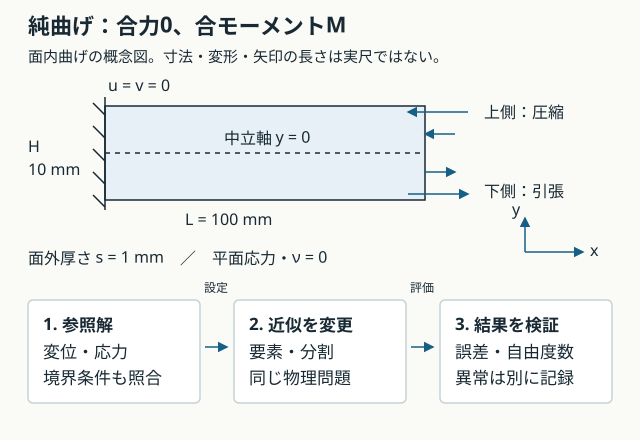
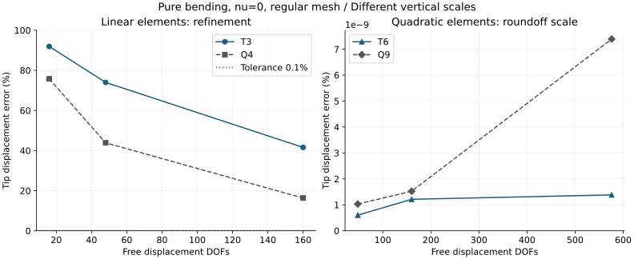

# 講義4：FEMの比較実験を設計する

[一問一答と解説](#一問一答と解説)

[ブラウザ版](04-fem-benchmark.html) · [講義3](03-fem.md) · [ロードマップ](../roadmap.md)

T3・T6・Q4・Q9の性質を、再現できる実験へ落とし込む。今回の到達点は「同じ物理問題を解いているか」「何を変え、何で誤差を測るか」を説明できること。第1〜5節は比較条件と参照解、第6節は実装した純曲げFEMの実測結果を示す。

## 1. 最初は解の分かる純曲げ



講義3では、一定曲率なら変位が二次式、ひずみが一次式になることを確認した。まずこの性質を利用し、要素が表せるはずの解を再現するかを検証する。その後、曲率が長さ方向に変わる荷重ケースでメッシュ収束を調べる。

対象は細長い長方形の**面内曲げ**。長さ方向x、曲げ深さ方向y、面外方向zとする。M0の幅b・板厚tの役割をそのまま持ち込まず、深さHと面外厚さsを区別する。ここでは面外が薄く、その面への荷重がない平面応力近似を採る。これは従来の加熱支持板と別の教育用検証ケースである。

| 入力 | 値 | 意味 |
|---|---:|---|
| L | 0.100 m | x方向の長さ |
| H | 0.010 m | y方向の曲げ深さ、−H/2 ≤ y ≤ H/2 |
| s | 0.001 m | z方向の面外厚さ |
| E | 70 GPa | 一様な線形弾性材料のヤング率 |
| ν | 0 | 検証のために選ぶPoisson比。実材料を同定した値ではない |
| M | 0.100 N·m | 右端に与える正のz軸まわりの合モーメント |

## 2. 力の分布までそろえる

左端x=0のu,vを固定し、上下面y=±H/2は無荷重。右端には次の表面力（単位Pa）を与える。qは変位ベクトルと区別するため、表面力をここではpと記す。

```math
I=\frac{sH^3}{12},\qquad p_x(y)=-\frac{My}{I},\qquad p_y=0
```

この分布は、断面上で力の合計が0、合モーメントがMになる。

```math
\int_{-H/2}^{H/2}p_x(y)s\,dy=0,\qquad
-\int_{-H/2}^{H/2}y\,p_x(y)s\,dy=M
```

2D連続体の節点にはu,vしかないので、梁のような回転自由度へ直接モーメントを入れない。境界の形関数Nを使い、**分布荷重から整合節点荷重を計算する**。

```math
\mathbf f_e=\int_{\Gamma_e}\mathbf N^T\mathbf p\,s\,d\Gamma
```

T3とT6では境界節点数が違う。全節点へ同じ数値の力を割り当てるのではなく、同じp(y)をそれぞれの補間で積分する。単位はPa×m×m=Nになる。合力と合モーメントの両方を確認し、荷重分布まで変更されていないかを確かめる。

## 3. 参照解と境界条件を照合する

### 補足：合力と合モーメントだけでは十分でない

荷重変換で両者を保存するのは必要条件だが、十分条件ではない。分布荷重と節点荷重が、要素の補間で表せるすべての仮想変位に対して同じ外力仮想仕事をする必要がある。仮想節点変位をδq、境界の仮想変位をNδqとすると、

```math
\delta\mathbf q^T\mathbf f_e
=\int_{\Gamma_e}(\mathbf N\delta\mathbf q)^T\mathbf p\,s\,d\Gamma
=\delta\mathbf q^T\int_{\Gamma_e}\mathbf N^T\mathbf p\,s\,d\Gamma
```

任意のδqについて一致させると、前節の整合節点荷重の式が得られる。[LUSAS：等価節点荷重の導出](https://www.lusas.com/user_area/theory/equivalent_force_distribution.html)

例として、直線の3節点二次境界に、垂直方向の一様荷重を加える。節点は端・中央・端に等間隔で置く。合力をPとしたときの整合配分は[P/6, 2P/3, P/6]。等分配[P/3, P/3, P/3]も合力と中央まわりのモーメントは同じだが、中央だけが荷重方向に仮想変位dすると、仕事はそれぞれ2Pd/3とPd/3となり一致しない。この一様荷重の例は、本文の純曲げ用の線形分布荷重とは区別する。

### 純曲げ参照場の確認

ν=0なら、次の変位場は平面応力の材料則・釣合い・上記の境界条件を満たす。

```math
\kappa=\frac{M}{EI},\quad
u=-\kappa xy,\quad v=\frac{\kappa x^2}{2},\quad
\sigma_x=-\frac{My}{I},\quad \sigma_y=\tau_{xy}=0
```

u(0,y)=v(0,y)=0で根元拘束を満たし、ε_x=−κy、ε_y=0、γ_xy=0となる。応力の発散も0で、右端の表面力と一致する。これは単に梁の数値を借りるだけでなく、この2Dモデルの解として照合できる設定である。

| 照合量 | 参照式 | 計算値 |
|---|---|---:|
| 断面二次モーメント | sH³/12 | 8.333333×10⁻¹¹ m⁴ |
| 曲率 | M/(EI) | 0.017142857 m⁻¹ |
| 先端中央のたわみ | v(L,0)=ML²/(2EI) | 0.085714286 mm |
| 上下縁の応力の大きさ | MH/(2I) | 6.000 MPa |
| 全ひずみエネルギー | M²L/(2EI) | 8.571429×10⁻⁵ J |

**νだけを実材料らしい値へ変えて、この参照変位をそのまま使ってはいけない。** ν≠0の純曲げには、横ひずみに対応するvのy²項が必要となり、左端全体のv=0と一般には両立しない。実材料のケースへ進むときは、拘束近傍の影響と参照解の適用範囲を改めて扱う。

## 4. 比較を三段階に分ける

| 段階 | 固定するもの | 変更するもの | 調べること |
|---|---|---|---|
| 正常な基準 | 形状、物性、荷重、拘束、規則格子 | 要素種類と次数 | 解の再現、自由度数と誤差 |
| メッシュ収束 | 同じ要素・積分法、同じ物理問題 | x/y方向の分割数 | 誤差の低下と必要な分割 |
| 品質・積分法 | 基準ケースの他の条件 | 内部節点位置、または積分法の一方 | ゆがみへの感度、ロッキング、異常検出 |

ゆがみの比較では外形を変えず、内部節点を移動する。T6の辺中点とQ9の辺中点・中央節点の置き方も規約化し、幾何写像と変位補間の変更を記録する。無効な要素は作り直すか、異常検出用ケースとして分ける。

8×2の長方形セルから始める例を考える。三角形では各セルを同じ向きの対角線で2分し、中間節点を共有する。Q9は各セルの中央にも節点を持つ。

| 要素 | 要素数 | 共有後の節点数 | 左端u,v拘束後の自由度数 |
|---|---:|---:|---:|
| T3 | 32 | 27 | 48 |
| Q4 | 16 | 27 | 48 |
| T6 | 32 | 85 | 160 |
| Q9 | 16 | 85 | 160 |

要素数が同じことと、未知数が同じことは違う。T3/Q4、T6/Q9はこの格子で全体自由度をそろえられるが、近似空間は異なる。次数を上げた効果を見る比較と、同程度の自由度での効率を見る比較を分ける。

積分の初期案は、直線辺T3の面積1点、T6の三角形3点、長方形Q4の2×2点、Q9の3×3点。これは一様材料・アフィン写像での剛性積分を基準とする。ゆがんだ非アフィン要素では積分精度も再確認する。Q4の安定化なし1点積分は正常な精度ランキングと分け、不要なゼロエネルギーモードの検出に使う。

## 5. 合格条件を、結果を見る前に書く

まず定数ひずみのパッチテスト、剛体運動、合力・合モーメント、拘束後の剛性、残差を検査する。その後、たわみ・応力・エネルギーを比較する。今回の学習用の初期目標は以下とし、実装時にスケーリングとともに版管理する。

- 先端たわみとエネルギーの参照誤差：各0.1%以下。
- 固定した物理位置での応力誤差：1%以下。例えば上縁のx/L=0.45、y=H/2を使い、端部を避ける。要素側の未平均値を記録し、節点平均化で誤差を隠さない。
- 参照値が0のσ_yやτ_xy：相対誤差で割らず、最大絶対値を応力尺度6 MPaで正規化して報告する。
- 反力の合力は0、反力モーメントは−M。力の残差はM/Hなどの非ゼロ尺度を使う。相対誤差の分母に0を置かない。
- errorはランキングから除外し、原因を保存する。正常に解けた精度不足は、誤差とともに比較表へ残す。

純曲げでは二次要素が解を含むため、最初から丸め誤差程度に一致する可能性がある。それを一般的なメッシュ収束の証拠とはしない。次に曲率が変化する荷重問題を追加する。

第6節では同じ環境で組み立て・求解・後処理を別々に測り、準備実行後の3回の中央値を記録した。誤差・自由度数・時間と計算状態を併記し、計算できたこと、精度が十分なこと、実物で妥当なことを分ける。

## 6. 実装を動かして比較する

M2bの最初の純曲げベンチマークを実装した。以下は同じ入力で実行した20条件の結果。AI支援による実装を、実装担当とは別モデルのCodexでレビューした。数値処理に重大な問題は見つからず、保存JSONの版番号に真偽値を許していた入力検証を修正した。数値実装の検証と実機の妥当性確認は区別する。

```powershell
.\run.cmd plane cases\plane_bending.toml
.\run.cmd plane cases\plane_bending.toml --output outputs\my-plane.json
.\run.cmd plane --replay outputs\my-plane.json
.\run.cmd plane cases\plane_diagnostics.toml
```

最後の診断コマンドは終了コード1が期待値。Q4の安定化なし1点積分で剛性の零エネルギーモード、逆順のT3で負のヤコビアンを検出する。結果の数値は不採用にし、理由付きerrorを保存する。正常な計算の精度不足はfailとして数値を残す。

終了コードは0＝全行計算成立かつ1行以上が検証合格、1＝入力・出力・計算エラー、2＝計算は成立したが全行が許容外。0でも全行合格ではない。製品評価には接続しておらず、既存の未評価分野は埋まらない。



左右の縦軸は異なる。二次要素の微小な誤差差で優劣を決めない。T3/Q4はこの分割範囲で誤差が減るが、0.1%のたわみ基準に届いていない。T6/Q9は今回の二次変位場を再現した。これは一般的なメッシュ収束の証明ではない。

| 条件ID | 未知数 | たわみ mm | たわみ誤差 % | σx誤差 % | エネルギー誤差 % | 時間 ms | 判定 |
|---|---:|---:|---:|---:|---:|---:|---|
| T3-4x1 | 16 | 0.00693953 | 91.904 | 91.919 | 91.859 | 3.52 | fail |
| T3-8x2 | 48 | 0.02230804 | 73.974 | 73.984 | 73.906 | 11.15 | fail |
| T3-16x4 | 160 | 0.05009336 | 41.558 | 41.553 | 41.4 | 43.80 | fail |
| T3-8x2-warped | 48 | 0.02013870 | 76.505 | 81.96 | 76.274 | 10.88 | fail |
| T3-8x2-warped-high | 48 | 0.02013870 | 76.505 | 81.96 | 76.274 | 48.48 | fail |
| T6-4x1 | 48 | 0.08571429 | 6.0307e-10 | 4.8592e-10 | 9.7856e-10 | 6.85 | pass |
| T6-8x2 | 160 | 0.08571429 | 1.2144e-09 | 1.0875e-09 | 2.3232e-09 | 24.66 | pass |
| T6-16x4 | 576 | 0.08571429 | 1.3838e-09 | 1.3697e-09 | 3.6228e-09 | 128.23 | pass |
| T6-8x2-warped | 160 | 0.08571429 | 4.5519e-12 | 1.1454e-10 | 3.8956e-10 | 24.49 | pass |
| Q4-4x1 | 16 | 0.02077922 | 75.758 | 75.758 | 75.758 | 4.15 | fail |
| Q4-8x2 | 48 | 0.04812030 | 43.86 | 43.86 | 43.86 | 14.87 | fail |
| Q4-16x4 | 160 | 0.07170595 | 16.343 | 16.34 | 16.311 | 60.26 | fail |
| Q4-8x2-warped | 48 | 0.04043074 | 52.831 | 60.053 | 51.939 | 15.66 | fail |
| Q9-4x1 | 48 | 0.08571429 | 1.0318e-09 | 8.2152e-10 | 6.8159e-10 | 4.99 | pass |
| Q9-8x2 | 160 | 0.08571429 | 1.5243e-09 | 1.044e-09 | 2.3948e-09 | 18.09 | pass |
| Q9-16x4 | 576 | 0.08571429 | 7.3914e-09 | 4.7297e-09 | 7.0159e-09 | 102.37 | pass |
| Q9-8x2-warped | 160 | 0.08571429 | 2.9887e-09 | 2.5029e-09 | 3.9079e-09 | 17.95 | pass |
| T6-8x2-warped-high | 160 | 0.08571429 | 4.8845e-10 | 3.5468e-10 | 1.2583e-09 | 79.15 | pass |
| Q4-8x2-warped-high | 48 | 0.04039161 | 52.876 | 60.104 | 51.98 | 36.04 | fail |
| Q9-8x2-warped-high | 160 | 0.08571429 | 6.4015e-10 | 6.4029e-10 | 8.5865e-10 | 30.86 | pass |

時間は1回の準備実行後、3回の組み立て・求解・後処理をそれぞれ測った中央値の合計。メッシュ生成・入出力は含まず、求解には固有値による剛性検査を含む。時間の総和の中央値ではない。Windows上のPython/NumPy/SciPyの版は[保存JSON](assets/plane-results.json)のruntime/provenanceに記録。実装とPCに依存する測定であり、要素固有の速度順位とはしない。

### メッシュと積分の規約

- nx,nyは元の長方形セルの分割数。三角形は左下から右上の対角線で2分する。二次要素の辺中点は共有し、Q9の中央は四隅の平均に置く。
- warpedは内部の元格子節点だけを規則的に移動する。xの移動はa/nx×sin(1.7i+0.6j)、yはa(H/L)/ny×cos(0.9i−1.2j)、a=0.2。端点を動かした後に辺中点を作る。外形は固定する。
- ゆがんだセル内で、T6の対角線中点とQ9の中央位置は一般には一致しない。座標まで同一の比較とは記さず、共有した元格子と配置規約を保存する。
- fullはT3=1点、T6=3点、Q4=2×2点、Q9=3×3点。highは四角形5×5点、三角形は5×5点のDuffy変換。warped/fullとwarped/highで積分だけを変える。Q4のたわみ誤差は約52.831%→52.877%となり、積分点を増やすだけでは近似の粗さを解消しない。
- ν=0、小ひずみ、直線辺、最大300節点の密行列ソルバー。形状品質検査はこの生成メッシュ用で、任意の曲線辺メッシュへ一般化しない。拘束後の最小/最大固有値比が10⁻¹²以下は、零エネルギーまたは悪条件としてerrorにする。

### 評価位置・保存・再計算

先端は(x,y)=(L,0)で補間する。応力は(0.45L,H/2)の要素側未平均値を保存し、複数要素に属する点では各側の誤差の最大を判定に使う。σyとせん断応力は、積分点と規定の形状検査点での**標本最大値**を6 MPaで正規化する。領域内の厳密な最大値とは主張しない。たわみ・エネルギー0.1%、各応力1%、合反力・反力モーメント・無次元残差10⁻⁸を検証基準とする。

JSONに入力、全節点座標、結合、拘束自由度、変位、応力評価位置、誤差、品質、各回の時間、コードと依存版を保存する。出力先は新規ファイルのみ。replayは保存された入力から再計算し、古い結果を表示する機能ではない。数値計算・比較を担うplaneの4モジュールのコードと、NumPy/SciPyの版不一致は拒否する。CLIや共有入力ヘルパーはこのコードハッシュの対象外。実行時間と丸め誤差は再実行で変わりうる。

図の再生成：`python scripts/plot_plane_results.py docs/learning/assets/plane-results.json docs/learning/assets`（Matplotlib 3.10.7）。次は曲率が変わる荷重ケースで近似誤差を調べる。

## 出典・再現と現在の範囲

- [TU Delft：線形弾性の強形式と平面応力](https://interactivetextbooks.citg.tudelft.nl/computational-modelling/continuum_linear/continuum_mechanics.html)：材料則と境界条件の根拠。
- [Abaqus：連続体要素の曲げ性能](https://docs.software.vt.edu/abaqusv2025/English/SIMACAEBMKRefMap/simabmk-c-linbending.htm)：要素次数・積分法・ゆがみを分ける比較の参考。本講義の寸法・荷重・参照解は独自の教育用設定で、このベンチマークの転載結果ではない。
- 参照値は本文の入力と式から計算し、第6節のFEM結果は独自実装で計算した。M2aの完全固定梁CLIも引き続き利用できる。
- 一問一答は共通の `assets/lecture-qa.json` から両版へ生成する。今後の講義にも問い・解答例・解説を併記し、個人の回答履歴とは分ける。

2026-09-08 / AI支援教材 / GitHub公開済み・配布ライセンス未設定

<!-- BEGIN GENERATED QA -->
## 一問一答と解説

各問でいったん考え、解答例と解説を開いて確認する。対話で扱った論点を汎用の教材として再構成したもので、個人の回答・成績・実行記録ではない。解答例を読んだことと、自分で説明・実行できたことは別に確認する。


### L4-Q01

**問い：** 一様なEIの部材で、先端横荷重Fの場合と端部モーメントMだけの場合では、曲率の長さ方向分布はどう違うか。

<details>
<summary>解答例と解説</summary>

**解答例：** 先端力ではκ(x)=F(L−x)/(EI)と変化し、純曲げではκ=M/(EI)で一定。

**解説：** この講義のMは右端の分布表面力で与える合モーメント。一定曲率なら二次の変位場を参照解として使え、要素の表現能力を確かめやすい。先端力ケースと同じ荷重問題ではない。

</details>

### L4-Q02

**問い：** この検証でPoisson比ν=0を選ぶ理由は何か。

<details>
<summary>解答例と解説</summary>

**解答例：** 単純な純曲げ参照変位と、左端全体のu=v=0を両立させるため。

**解説：** ν≠0では横ひずみに対応するvのy²項が必要になる。参照解が材料則だけでなく、実際に与える拘束も満たすかを確認する。ν=0は実材料に合わせた値ではなく、検証のための設定。

</details>

### L4-Q03

**問い：** 曲げ深さHを2倍にすると、他を固定した断面二次モーメントIは何倍か。面外厚さsではどうか。

<details>
<summary>解答例と解説</summary>

**解答例：** Hを2倍なら8倍、sを2倍なら2倍。

**解説：** I=sH³/12。2D図面内の曲げ深さと、平面応力モデルの面外厚さは異なる。M0の幅・厚みという名称だけで対応付けず、曲げ軸と断面を確認する。

</details>

### L4-Q04

**問い：** 右端のp_x=−My/Iは力[N]か、それとも表面力[Pa]か。

<details>
<summary>解答例と解説</summary>

**解答例：** 単位面積あたりの表面力[Pa]。

**解説：** N·m×m/m⁴=N/m²となる。境界線に沿う積分では面外厚さsを掛け、面積を作る。整合節点荷重はNの単位になる。

> f_e = ∫ Nᵀp s dΓ

</details>

### L4-Q05

**問い：** 右端表面力の合力が0なら、曲げモーメントも0か。

<details>
<summary>解答例と解説</summary>

**解答例：** 0とは限らず、この分布ではMが残る。

**解説：** 上側の左向き力と下側の右向き力は相殺するが、モーメントの向きは同じになる。ΣFだけでなくΣ(r×F)も確認する。

> ∫p_x s dy = 0； −∫y p_x s dy = M

</details>

### L4-Q06

**問い：** T3からT6へ変え、境界節点が増えたら、各節点に同じ数値の力を与えてよいか。

<details>
<summary>解答例と解説</summary>

**解答例：** よくない。同じ表面力分布を、各要素の境界形関数で積分する。

**解説：** 単純な節点への等分配では合力・合モーメントや仮想仕事が変わる可能性がある。形状だけをそろえても、荷重の与え方が違えば要素の性能比較にならない。

</details>

### L4-Q07

**問い：** 8×2セルのQ4と、同じセルを2分したT3は、全体の自由度数も2倍違うか。

<details>
<summary>解答例と解説</summary>

**解答例：** 違わない。この格子では共有節点はともに27、左端拘束後は48自由度。

**解説：** Q4は16要素、T3は32要素だが、頂点の集合は同じ。左端3節点の各2自由度を拘束すると2×(27−3)=48。要素数と全体の未知数を区別する。

</details>

### L4-Q08

**問い：** 純曲げで二次要素のたわみが最初から一致したら、一般の荷重でも粗いメッシュで十分か。

<details>
<summary>解答例と解説</summary>

**解答例：** 一般化できない。

**解説：** 今回は補間空間が参照変位を含む特別なケース。荷重分布・形状・物性・拘束が変われば、解は同じ次数の多項式とは限らない。曲率が変わるケースで収束も検証する。

</details>

### L4-Q09

**問い：** 参照値が0のτ_xyについて、通常の相対誤差を計算してよいか。

<details>
<summary>解答例と解説</summary>

**解答例：** 0で割るため使えない。非ゼロの応力尺度で正規化する。

**解説：** このケースでは最大絶対せん断応力を参照曲げ応力6 MPaで割って報告できる。合反力0も同様にM/Hなどの力の尺度を使う。正規化の方法と単位を記録する。

</details>

### L4-Q10

**問い：** 要素のゆがみだけを調べるとき、外周節点も動かして部品の外形を変えてよいか。

<details>
<summary>解答例と解説</summary>

**解答例：** 外形を変えると物理問題も変わるため、基準比較では内部節点だけを動かす。

**解説：** 荷重境界や拘束位置を保持し、中間節点も決めた規約で配置する。T6/Q9では幾何写像への影響も含めて記録し、ヤコビアンと積分精度を確認する。

</details>

### L4-Q11

**問い：** 先端たわみが参照解に近ければ、応力・反力・エネルギーの照合を省略できるか。

<details>
<summary>解答例と解説</summary>

**解答例：** 省略できない。

**解説：** 一つの指標の偶然の一致や誤差の相殺があり得る。荷重の釣合い、拘束、応力の評価位置、エネルギー、残差も確認する。節点平均化した応力だけで、要素ごとの差を隠さない。

</details>

### L4-Q12

**問い：** 成立しないケースと、正常に解けたが誤差が許容値を超えるケースは同じ扱いにするか。

<details>
<summary>解答例と解説</summary>

**解答例：** 分ける。前者はerrorでランキング外、後者は精度不足として誤差を残す。

**解説：** 品質・拘束・解の成立性を確認してから収束と精度を判定する。時間が短いことや数値が出たことだけで採用しない。M2bではこの状態と入力・メッシュ・ソルバー設定を一緒に保存する。

</details>

### L4-Q13

**問い：** 参照変位を正解として使うには、材料則や釣合いに加えて何を満たす必要があるか。

<details>
<summary>解答例と解説</summary>

**解答例：** 指定した変位の拘束条件と、指定した荷重境界条件。

**解説：** 今回のν=0の参照場はx=0でu=v=0となり、右端で応力から得る表面力もp_x=−My/Iに一致する。式だけを借りて、異なる支持や荷重に適用しない。

</details>

### L4-Q14

**問い：** ν>0の線形弾性材料をx方向に圧縮すると、横方向が自由な場合のy方向の変形はどうなるか。

<details>
<summary>解答例と解説</summary>

**解答例：** y方向に広がる。

**解説：** 横方向の応力が0ならε_y=−νε_x。圧縮ε_x<0に対しε_y>0となる。横方向を拘束した場合は、この自由な伸びが抑えられ、横方向応力が生じるため条件を区別する。

</details>

### L4-Q15

**問い：** ν>0、κ≠0の純曲げでv=κ(x²+νy²)/2とすると、根元全体のv=0を満たすか。

<details>
<summary>解答例と解説</summary>

**解答例：** 満たさない。x=0でもv=νκy²/2が残る。

**解説：** さらにy=0を代入すれば0になるが、それは根元中央の1点だけ。根元全体の拘束確認にはならない。今回ν=0を採るのは、単純な純曲げ参照場と根元全体の完全固定を両立させるため。

</details>

### L4-Q16

**問い：** 変換後の合力と合モーメントが一致していれば、節点荷重の配分方法は何でもよいか。

<details>
<summary>解答例と解説</summary>

**解答例：** よくない。一致は必要条件であって十分条件ではない。

**解説：** 合力と合モーメントの照合だけでは、変形する仮想変位に対する仕事の一致を保証しない。要素の補間で表せるすべての仮想変位について、分布荷重と節点荷重の外力仮想仕事を一致させると、整合節点荷重f_e=∫Nᵀp s dΓが得られる。

> δqᵀ f_e = ∫ (Nδq)ᵀ p s dΓ

[出典・照合先](https://www.lusas.com/user_area/theory/equivalent_force_distribution.html)

</details>

### L4-Q17

**問い：** 直線の3節点二次境界に一様荷重を与える例で、合力Pを端・中央・端へ[P/3,P/3,P/3]と[P/6,2P/3,P/6]で配る。中央だけを荷重方向へ仮想変位dさせたときの仕事は同じか。

<details>
<summary>解答例と解説</summary>

**解答例：** 異なる。等分配ではPd/3、整合配分では2Pd/3となる。

**解説：** 節点は等間隔、荷重は境界に垂直な同一方向とする。両配分は合力Pと中央まわりのモーメント0を満たすが、二次の仮想変形に対する仕事が違う。一様分布荷重の仕事と一致する配分は1:4:1である。これは説明用の一様荷重であり、本文の純曲げの線形荷重p_x=−My/Iとは別の例。

[出典・照合先](https://www.lusas.com/user_area/theory/equivalent_force_distribution.html)

</details>

### L4-Q18

**問い：** ゼロ応力の検証で、応力尺度6 MPaに対する正規化誤差が0.005だった。百分率ではいくらか。

<details>
<summary>解答例と解説</summary>

**解答例：** 0.5%。

**解説：** 0.005×100=0.5。0.005%と取り違えない。参照応力0で割らず、非ゼロの応力尺度を使った値である。

</details>

### L4-Q19

**問い：** 負のヤコビアンのケースと、正常に解けたがたわみ誤差15.2%のケースを、比較表でどう区別するか。

<details>
<summary>解答例と解説</summary>

**解答例：** 前者はerrorとして数値結果を不採用、後者は15.2%を残してfailとする。

**解説：** errorにはnegative_or_zero_jacobianなど原因を添え、精度ランキングから除く。N/Aだけでは未評価との区別がつかないため状態も記す。負の行列式が単なる節点順序の逆転なら、順序を修正して再検証できる。正常な精度不足は改善のための比較データとして残す。

</details>

### L4-Q20

**問い：** 純曲げでT6とQ9の誤差が約10⁻⁹%だった。より小さい方を一般に優秀な要素と断定できるか。

<details>
<summary>解答例と解説</summary>

**解答例：** 断定できない。今回の解を両要素が表現でき、差は丸め誤差の尺度にある。

**解説：** この条件での再現性を確認した結果である。曲率が変わるケース、応力集中、別の境界条件でも比較する必要がある。自由度数と積分法をそろえ、丸め誤差の小さな順位を設計判断に使わない。

</details>

### L4-Q21

**問い：** 比較CLIがokを返しても、T3やQ4の行にfailがあるのは矛盾か。

<details>
<summary>解答例と解説</summary>

**解答例：** 矛盾しない。okは全ケースが計算でき、少なくとも一つが今回の検証基準を満たすという集計状態。

**解説：** 各行のpass/fail/errorと、qualified_idsを確認する。okは全ケース合格や製品承認を意味しない。疲労などの未評価分野をこのベンチマークで埋めることもできない。

</details>

### L4-Q22

**問い：** 規則格子のQ4-8x2とT6-4x1は、どちらも27節点・拘束後48自由度である。T6は8要素、Q4は16要素なのに、純曲げのたわみ誤差がT6で小さくなるのはなぜか。

<details>
<summary>解答例と解説</summary>

**解答例：** 自由度数だけでは近似空間が決まらないため。T6は今回の二次変位場を表現できるが、長方形Q4の双一次補間はx²の項を表現できない。

**解説：** 同じ物理条件・規則格子での比較であり、要素数を多くしただけで高精度になるとは限らない。純曲げ参照場はu=−κxy、v=κx²/2。T6は完全な二次多項式を含む一方、長方形Q4の補間は1,x,y,xyの組合せなのでvのx²が不足する。未知数が同じでも、結合と補間関数が異なる。今回の再現性を確認する例であり、別の荷重や形状でもT6が常に優れるとは断定しない。

> Q4-8x2：16要素・48自由度・たわみ誤差43.8596%；T6-4x1：8要素・48自由度・約6.03×10⁻¹⁰%

</details>

### L4-Q23

**問い：** 純曲げの参照変位u=−κxy、v=κx²/2（κは一定）について、工学せん断ひずみγ_xy=∂u/∂y+∂v/∂xはいくらになるか。

<details>
<summary>解答例と解説</summary>

**解答例：** 0になる。∂u/∂y=−κxと∂v/∂x=κxが打ち消し合う。

**解説：** 小ひずみの面内変形を考える。純曲げでは軸ひずみε_x=−κyは生じるが、工学せん断ひずみは0である。横変位vの傾きだけでせん断ひずみと判断せず、uのy方向微分も合わせる。次に、Q4補間がこの打ち消しを要素内で維持できるかを調べる。ここでγ_xyは工学せん断ひずみで、ひずみテンソルの成分ε_xyの2倍。

> γ_xy = −κx + κx = 0； ε_x = ∂u/∂x = −κy

</details>
<!-- END GENERATED QA -->
