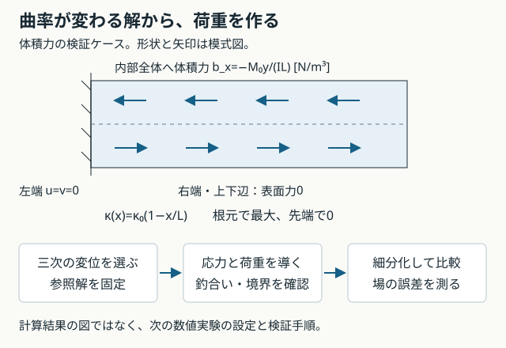

# 講義5：曲率が変わる問題でメッシュ収束を確かめる

[一問一答と解説](#一問一答と解説)

[ブラウザ版](05-mesh-convergence.html) · [講義4](04-fem-benchmark.md) · [ロードマップ](../roadmap.md)

ここからは、要素が解を再現できるかに加えて、**解を厳密には表せないときに、細分化で誤差が減るか**を調べる。確認は節目のまとめ問題で行い、既に説明できた微分計算の反復は省く。一問一答と解説は復習用に残す。

この講義は次の数値実験の定式化・実装仕様である。参照解の式は検証したが、新しい体積力ケースのFEM計算はまだ実装していない。既存の `plane` CLIは講義4の純曲げ用のまま。

## 1. 前節の結び：余分なせん断エネルギー

参照解の節点値を長方形Q4へ入れると、γ_xy,h=κ(ℓ/2−x)となった。中央で0でも、二乗した値の積分は0にならない。

```math
U_s=\frac12\int_\Omega G\gamma_{xy,h}^2\,s\,d\Omega
=\frac{GsH\kappa^2\ell^3}{24}>0
```

この式は0≤x≤ℓ、−H/2≤y≤H/2の**曲げ深さ全体を1要素で表す長方形**についての式。Gはせん断弾性率、sは面外厚さである。同じ参照曲率に対する曲げエネルギーU_b=EIκ²ℓ/2と比較すると、

```math
\frac{U_s}{U_b}=\frac{G}{E}\left(\frac{\ell}{H}\right)^2
```

要素が長細いほど、不要なせん断成分の負担が大きくなる。同じ曲げ変形に余分なエネルギーが必要になり、荷重に対して硬い応答になる仕組みが分かる。これは**参照節点変位の補間を調べた式**であり、求解後のFEM変位を直接与える式ではない。

中央1点だけでせん断を積分すると、この成分を見逃す。一方、安定化なしQ4の1点積分には零エネルギーモードの問題もある。単に積分点を減らして全て解決したとは扱わない。

## 2. 二次要素が解を含まない問題を用意する



講義4のν=0、寸法L=0.1 m、H=0.01 m、s=0.001 m、E=70 GPaを引き継ぐ。今回はM₀=0.1 N·mを**根元の曲げモーメントの尺度**とし、右端にモーメントを与える入力とは区別する。I=sH³/12、κ₀=M₀/(EI)とする。

```math
\kappa(x)=\kappa_0\left(1-\frac{x}{L}\right),\qquad
u^*=-\kappa_0y\left(x-\frac{x^2}{2L}\right),\qquad
v^*=\kappa_0\left(\frac{x^2}{2}-\frac{x^3}{6L}\right)
```

v*は三次式なので、T6やQ9でも要素内で厳密には表せない。T6は完全二次、長方形Q9は各座標について二次までの積を含むが、x³は含まない。T6ではu*のx²yも不足する。

これだけでは荷重問題は決まらない。**変位・材料則・荷重・拘束が同じ問題を記述するよう、次節で整合させる。**

## 3. 変位から、必要な荷重を導く

小ひずみ、ν=0の平面応力材料則を使うと、

```math
\varepsilon_x^*=-\kappa_0y(1-x/L),\quad
\varepsilon_y^*=\gamma_{xy}^*=0,\quad
\sigma_x^*=-\frac{M_0y}{I}(1-x/L),\quad \sigma_y^*=\tau_{xy}^*=0
```

応力の発散は0ではない。静的な釣合いdiv σ+b=0を満たすため、単位体積あたりの力bを次のように定める。

```math
b_x=-\frac{\partial\sigma_x^*}{\partial x}
=-\frac{M_0y}{IL},\qquad b_y=0
```

**bの単位はN/m³**。右端に与えた表面力p[Pa=N/m²]とも、節点力[N]とも異なる。上半分に左向き、下半分に右向きの力が、部材内部全体に作用する検証用設定である。

| 境界・荷重 | 条件と照合 |
|---|---|
| 左端 | u*=v*=0。従来と同じく両変位を拘束 |
| 右端 | x=Lでσx*=0、せん断応力も0。表面力は0 |
| 上下辺 | 法線はy方向。σy*=τxy*=0なので表面力は0 |
| 内部 | b_x=−M₀y/(IL)、b_y=0 |
| 全体の釣合い | 合力0、体積力の合モーメント+M₀、支持反力モーメント−M₀（+zを正） |

これは**製造解法（Method of Manufactured Solutions、MMS）**によるコード検証ケースである。先に滑らかな変位を選び、方程式と境界条件から対応する荷重を導く。実物の荷重を都合よく変更する設計手法ではなく、数値実装を照合するための問題作りである。[SandiaのMMS解説](https://www.sandia.gov/research/publications/details/code-verification-by-the-method-of-manufactured-solutions-2000-06-01/)、[固体力学への適用例](https://arxiv.org/abs/1902.07608)

## 4. 実装前に固定する参照値

| 照合量 | 式 | 参照値 |
|---|---|---:|
| 先端中央たわみ | M₀L²/(3EI) | 0.057142857 mm |
| ひずみエネルギー | M₀²L/(6EI) | 2.857142857×10⁻⁵ J |
| 最大の縁応力の大きさ | M₀H/(2I)、根元 | 6.000 MPa |
| 上縁x/L=0.45のσx | −0.55 M₀H/(2I) | −3.300 MPa |
| 体積力b_x、y=H/2 | −M₀H/(2IL) | −6.000×10⁷ N/m³ |
| 根元の反力モーメント | −M₀ | −0.100 N·m |

これらはFEMの実測結果ではない。式の微分・体積積分により釣合い、単位、エネルギーを照合する参照値である。ν≠0へ変更した場合は、この材料則と参照解をそのまま使わない。

## 5. 点の値だけでなく、変位場の誤差を測る

先端1点が偶然よく一致しても、内部の変位やひずみが正しいとは限らない。ベクトル変位w=(u,v)と工学ひずみベクトルε=(εx,εy,γxy)を使い、次の2量を追加する。

```math
e_u=\sqrt{\frac{\int_\Omega\|\mathbf w_h-\mathbf w^*\|^2s\,d\Omega}
{\int_\Omega\|\mathbf w^*\|^2s\,d\Omega}},\qquad
e_E=\sqrt{\frac{\int_\Omega(\boldsymbol\varepsilon_h-\boldsymbol\varepsilon^*)^T
\mathbf D(\boldsymbol\varepsilon_h-\boldsymbol\varepsilon^*)s\,d\Omega}
{\int_\Omega\boldsymbol\varepsilon^{*T}\mathbf D\boldsymbol\varepsilon^*s\,d\Omega}}
```

D=diag(E,E,G)、ν=0ではG=E/2。e_Eは**ひずみ場の差のエネルギーノルム**であり、従来の総エネルギーの相対差|U_h−U*|/U*とは異なる。どちらも名前を区別して記録する。

nx,nyをともに2倍にし、同じ要素・積分法・外形で比較する。代表メッシュ寸法hが半分になり、誤差が正なら、観測収束次数をp_obs=log₂[e(h)/e(h/2)]で求める。丸め誤差域や誤差0にはこの式を使わない。例えば0.08→0.02なら、その区間での観測次数は2となる。1組だけで漸近的な収束を断定しない。

## 6. 次の実装の受入条件

1. 講義4の純曲げと新しい体積力ケースを明示的に分け、旧スナップショットを黙って別の荷重へ解釈しない。
2. 節点荷重f_e=∫Ωe Nᵀb s dΩを実装する。合力・合モーメントだけでなく、補間できる仮想変位に対する仕事も検査する。
3. **荷重・誤差評価の積分則を、剛性の積分則とは別に決める。** アフィンT6のNᵀbは全次数3となり、全次数2まで厳密な三角形3点則では一般に足りない。既存の高次積分則を使って照合する。変位誤差の二乗にも十分な積分精度が必要。
4. 参照値、境界、反力、残差、体積力の仕事をテストし、e_u・e_Eと点の誤差を複数の分割で保存する。
5. 同じモデル内で、hを半減したときの誤差と観測次数を比較する。純曲げの微小誤差との大小だけで要素を評価しない。

実装後は、実行結果の1表で「荷重の整合・場の誤差・収束・未評価の範囲」をまとめて確認して次へ進む。確認問題を全問順番に解かないと進めない運用にはしない。

## 出典と範囲

MMSの考え方は上記Sandia報告と固体力学論文を参照。本講義の寸法・変位場・体積力と数値は、本プロジェクトの教育用設定として導出した。実装結果や他論文の計算値の転載ではない。新しいFEM荷重ケースは未実装、実機の妥当性確認は未実施。

2026-09-09 / AI支援教材 / GitHub公開済み・配布ライセンス未設定

<!-- BEGIN GENERATED QA -->
## 一問一答と解説

各問でいったん考え、解答例と解説を開いて確認する。対話で扱った論点を汎用の教材として再構成したもので、個人の回答・成績・実行記録ではない。解答例を読んだことと、自分で説明・実行できたことは別に確認する。


### L5-Q01

**問い：** Q4の寄生せん断ひずみは中央で0になる。せん断エネルギーも0になるか。

<details>
<summary>解答例と解説</summary>

**解答例：** ならない。全域でのせん断ひずみの二乗を積分するため、κ≠0なら正となる。

**解説：** 長方形の参照節点変位の補間ではU_s=GsHκ²ℓ³/24。符号が左右で反転しても二乗したエネルギーは相殺しない。中央1点の評価と、全体の積分を区別する。

</details>

### L5-Q02

**問い：** 新しい参照変位で応力の発散が0でないのに、体積力を省いてよいか。

<details>
<summary>解答例と解説</summary>

**解答例：** 省けない。div σ+b=0を満たすb_x=−M₀y/(IL)が必要。

**解説：** bはN/m³。境界の表面力や節点力と区別し、∫Nᵀb s dΩで荷重ベクトルへ変換する。参照解の形だけを変更すると、異なる荷重問題を照合する誤りになる。

</details>

### L5-Q03

**問い：** 三次変位のケースで、先端たわみがよく一致したら収束確認は十分か。

<details>
<summary>解答例と解説</summary>

**解答例：** 十分ではない。内部を含む変位場・ひずみ場の誤差も、複数の分割で確認する。

**解説：** 一点の超収束や偶然の一致がありうる。e_uとe_Eを使い、総エネルギーの差とひずみ場の差のノルムも区別する。

</details>

### L5-Q04

**問い：** hを半分にして誤差が0.08から0.02になった。この区間の観測収束次数と、解釈の限界は何か。

<details>
<summary>解答例と解説</summary>

**解答例：** log₂(0.08/0.02)=2。ただし1組だけで漸近収束を断定しない。

**解説：** 同じ要素、積分法、荷重、外形と、同じ誤差指標を使う。複数段階の結果を見る。誤差0や丸め誤差域では、この比から収束次数を判断しない。

</details>
<!-- END GENERATED QA -->
