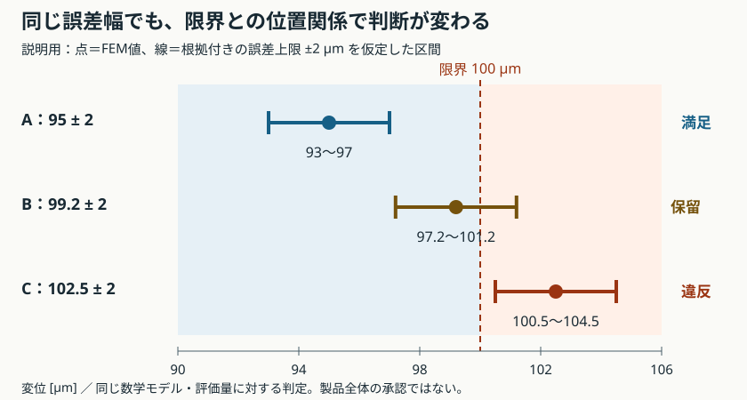

# 講義6：評価量と必要精度を決める

[一問一答と解説](#一問一答と解説)

[ブラウザ版](06-accuracy-budget.html) · [講義5](05-mesh-convergence.md) · [ロードマップ](../roadmap.md)

**「計算値が限界以内」と「誤差を考慮しても限界以内」は別の判断である。** この講義では、設計で使う評価量を選び、その量の誤差と設計余裕を比べる。確認は最後のまとめで行い、一問一答は復習にも使う。

今回は評価仕様を決める講義。以下の限界値・誤差幅は説明用の仮定で、既存ケースの入力・合否基準やCLIには追加していない。

## 1. 何を判断するための精度か

講義5の保存結果では、最細分割Q9の先端変位誤差は約0.00349%、ひずみ場のエネルギーノルム誤差e_Eは約0.585%だった。[計算結果JSON](assets/mms-results.json)

この二つは評価対象と定義が違う。e_Eは領域全体で積分した誤差であり、ある一点の応力誤差を「0.585%以下」と保証しない。

| 設計上の目的 | 評価量Qの例 | あわせて固定する条件 |
|---|---|---|
| 接触・干渉を防ぐ | 指定位置・方向の変位、または隙間 | 位置、座標系、荷重、相手部品の変位 |
| 局所的な降伏を避ける | 定義した位置の相当応力 | 材料則、形状、評価位置、応力の平均化方法 |
| 共振を避ける | 対応づけたモードの固有振動数 | 支持剛性、付加質量、モードの取り違え |
| 過熱を避ける | 指定部品の温度または最高温度 | 発熱、接触熱抵抗、対流・放射、評価時刻 |

この表は将来の選び方であり、全項目をMMSで実装済みという意味ではない。最大応力を使う場合も、鋭い角の特異点の最大値を追い続ける前に、形状と評価方法の妥当性を確認する。メッシュごとに評価位置や平均化を変えると、同じQの比較にならない。

## 2. 設計余裕と誤差幅を比べる

上限制約Q≤Q_limを考える。Q_hをFEM値、Q_modelを同じモデルの連続体解とする。この節だけは、数値誤差の上限Δ_numが根拠付きで与えられ、|Q_model−Q_h|≤Δ_numを満たすと仮定する。

```math
Q_{\rm model}\in[Q_h-\Delta_{\rm num},\ Q_h+\Delta_{\rm num}],\qquad
m=Q_{\rm lim}-Q_h
```

- 区間の上端が限界以下：このモデル・この評価量の制約を満たす。
- 区間の下端が限界より大きい：このモデル・この評価量の制約に違反する。
- 区間の下端≤限界<上端：数値誤差を考慮すると合否を確定できない。下端が限界と一致する場合も含む。

等号は上限制約の合格側に含める。公称値が限界以下のとき、Δ_num≤mなら数値誤差を含めてもモデル上の制約を満たす。m<0ならこの満足条件は使えない。



| 説明用の例 | FEM変位Q_h | 誤差上限Δ_num | Q_modelの区間 | 限界100 µmに対する判定 |
|---|---:|---:|---:|---|
| A | 95 µm | 2 µm | 93〜97 µm | モデル上の制約を満たす |
| B | 99.2 µm | 2 µm | 97.2〜101.2 µm | 判定保留 |
| C | 102.5 µm | 2 µm | 100.5〜104.5 µm | モデル上の制約に違反 |

100 µm=0.1 mm。これらはFEM実測値ではない。誤差上限は、単なる「1%くらい」という推測や、メッシュ間の差をそのまま置いた値ではない。上限が未取得なら0として埋めず、未評価として扱う。区間を作る情報がない状態と、有効な区間が限界をまたぐ状態も区別する。

## 3. メッシュを細かくしても消えない差がある

前節の区間は同じ数学モデルの解を対象にしている。実機では支持剛性、荷重、寸法、物性などの差も影響する。数値誤差が小さくても、根元を剛固定としたモデルが実機の弾性支持と一致するとは限らない。

同じQに換算した数値誤差上限Δ_numと、その他の差の上限Δ_otherをそれぞれ根拠付きで持つなら、三角不等式により、合計Δ_num+Δ_otherを保守的な上限にできる。Δ_otherの妥当性確認と、同じ差を二重に数えない整理が必要である。

説明用にQ_h=95 µm、限界100 µm、Δ_other=3 µmとする。数値誤差へ配分できる幅は最大2 µmとなる。

```math
\Delta_{\rm num}\le Q_{\rm lim}-Q_h-\Delta_{\rm other}
=100-95-3=2\;\mu{\rm m}
```

右辺が負なら、現在のQ_hとΔ_otherを固定したままΔ_numだけを小さくしても、この満足条件は達成できない。細分化ではQ_h自体も変わるため、更新した値で余裕を再計算する。必要に応じて設計、モデル、入力範囲、上限の根拠を見直す。未知の差を便宜的に0と置いたり、確率モデルなしに二乗和平方根で小さく合成したりしない。

## 4. 参照解がないときの誤差推定

MMSには参照解があるが、一般形状ではQ_modelが不明なことが多い。その場合、系統的に細分化した同じQから離散化誤差を推定する方法がある。Richardson外挿はQ(h)≈Q₀+C h^pという主要誤差項の近似に基づく。十分細かい漸近域と、比較条件の一貫性が前提となる。[NASAの格子収束解説](https://www.grc.nasa.gov/www/wind/valid/tutorial/spatconv.html)

粗→中→細のh、h/2、h/4で得たQ_c,Q_m,Q_fについて、差が同符号で非ゼロ、減少し、丸め誤差に埋もれない場合の式は次のとおり。

```math
p=\log_2\left|\frac{Q_c-Q_m}{Q_m-Q_f}\right|,\qquad
Q_0\approx Q_f+\frac{Q_f-Q_m}{2^p-1},\qquad
\widehat\Delta_{\rm num}=\frac{|Q_f-Q_m|}{2^p-1}
```

記号計算用の例として80→92→95 µmなら、p=2、Q₀≈96 µm、細分割の誤差推定は1 µmとなる。これはFEM実測値でも、誤差1 µm以内の厳密保証でもない。3値が式に合うだけで漸近域とは断定できず、追加の分割での安定性、数値積分・解法の誤差、境界や特異性を調べる。差の符号が交互に変わる場合やp≤0には、この単純な式をそのまま適用しない。

**推定値Δ̂_numと、保証された上限Δ_numを分けて記録する。** 近い二つのメッシュ解が、同じモデル誤差を共有している可能性もある。Richardson推定機能と区間判定は現CLIでは未実装である。

## 5. 次の実装へ渡す評価仕様

| 必須の情報 | 記録内容 |
|---|---|
| 評価量 | 指標名、SI単位、位置・方向・領域、応力なら平均化方法 |
| 要求 | 上限または下限、値、要求の出典と版 |
| 計算条件 | 形状、物性、荷重、拘束、要素・積分・メッシュ・ソルバー版 |
| 精度の根拠 | 参照解との誤差、推定値、保証上限のどれか。方法・適用条件・比較系列 |
| 未評価の差 | 支持、入力、物性、実機との差など、今回含めていない範囲 |
| 判定 | 計算エラー、精度未評価、モデル上の満足・違反、区間が限界をまたぐ保留を区別 |

誤差上限が未取得なら「精度未評価」。取得できて区間が限界をまたぐなら「判定保留」。この区別を統合ツールでも保持し、単純なOK/NGへ情報を落とさない。

## 節目のまとめ

以下の一問一答のうち、まずBの例を使って「区間・判定・次に調べること」をまとめて説明する。十分に説明できたら、同じ計算の反復をせず評価仕様の具体化へ進む。

## 出典と範囲

- 講義5の数値は本リポジトリの保存結果から引用した。局所応力の誤差保証への読み替えはできない。
- 区間図、A/B/C、誤差配分、80→92→95の数列は本教材の説明用設定。
- Richardson外挿は上記NASAの解説を参照。流体の格子収束を扱う一次資料であり、本教材の構造モデルの妥当性や許容値を認定する資料ではない。

2026-09-10 / AI支援教材 / 実機妥当性は未検証 / 配布ライセンス未設定

<!-- BEGIN GENERATED QA -->
## 一問一答と解説

各問でいったん考え、解答例と解説を開いて確認する。対話で扱った論点を汎用の教材として再構成したもので、個人の回答・成績・実行記録ではない。解答例を読んだことと、自分で説明・実行できたことは別に確認する。


### L6-Q01

**問い：** 限界100 µm、FEM変位99.2 µm。根拠付きの数値誤差上限が2 µmなら、モデル上の制約を満たすと確定できるか。区間・判定・次の確認を説明する。

<details>
<summary>解答例と解説</summary>

**解答例：** 区間は97.2〜101.2 µmで限界をまたぐため、判定保留。現在のQ_hを基準とする数値誤差の予算は0.8 µm。細分化後は新しいQ_hで余裕を計算し直す。

**解説：** 数値誤差だけを考える説明用設定。公称値が限界以下でも、区間の上端が101.2 µmなので満足は保証できない。同時に下端は限界以下なので違反とも確定できない。誤差上限の根拠と細分化で減る成分を確認する。実機への判断には入力・支持等の差も別に考える。

</details>

### L6-Q02

**問い：** 講義5のエネルギーノルム誤差e_E=0.585%を、切り欠きの一点の応力誤差上限0.585%として使えるか。

<details>
<summary>解答例と解説</summary>

**解答例：** 使えない。領域全体の積分ノルムと、局所の応力誤差は異なる評価量。

**解説：** 小さな領域の大きな誤差が、全体のノルムでは目立たないことがある。必要な位置・応力成分または相当応力・平均化方法を固定して、その量の収束と形状の妥当性を調べる。特異点の最大値を追い続ける設定も見直す。

</details>

### L6-Q03

**問い：** Q_h=95 µm、限界100 µm、同じ評価量に換算したその他の差の上限Δ_other=3 µm。全体の保守的な満足条件を満たすため、数値誤差へ最大何µmを配分できるか。

<details>
<summary>解答例と解説</summary>

**解答例：** 2 µm。95+3+Δ_num≤100よりΔ_num≤2。

**解説：** 各上限に根拠があり、同じQの差を重複なく扱う前提。未知の差を0と置かない。余裕が残らない場合は、設計やモデル・入力範囲の見直しも必要になる。確率モデルなしの二乗和平方根で上限を縮めない。

</details>

### L6-Q04

**問い：** hを半減した3段階でQが80→92→95 µmだった。単純なRichardson外挿によるp、外挿値、最細分割の誤差推定を求め、保証の限界を説明する。

<details>
<summary>解答例と解説</summary>

**解答例：** p=log₂(12/3)=2、外挿値96 µm、誤差推定1 µm。ただし厳密な誤差上限ではない。

**解説：** Q(h)≈Q₀+C h^pという主要項が支配し、同じQ・同じ条件を系統的に細分化する前提。3値だけで漸近域とは断定せず、追加分割で安定性を確認する。差が0、丸め誤差域、交互符号、p≤0ではこの式をそのまま使わない。推定と保証上限を区別して記録する。

[出典・照合先](https://www.grc.nasa.gov/www/wind/valid/tutorial/spatconv.html)

</details>
<!-- END GENERATED QA -->
